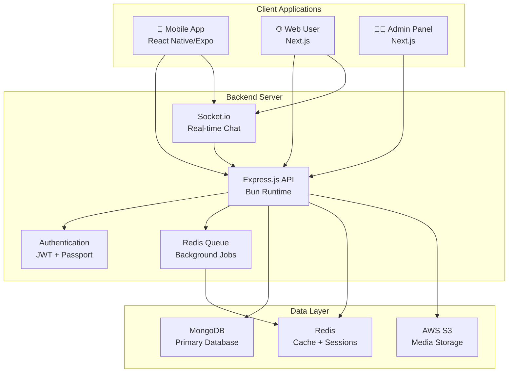
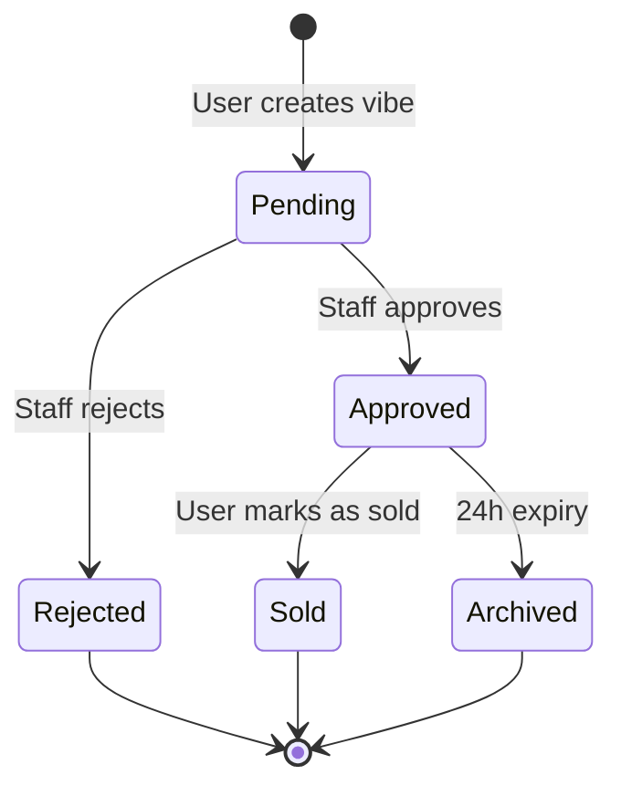
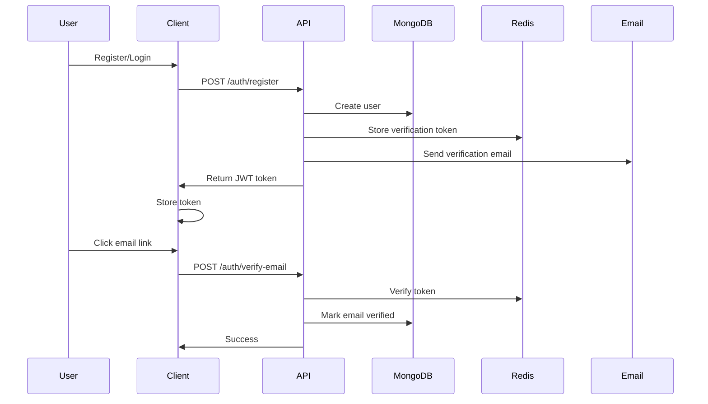
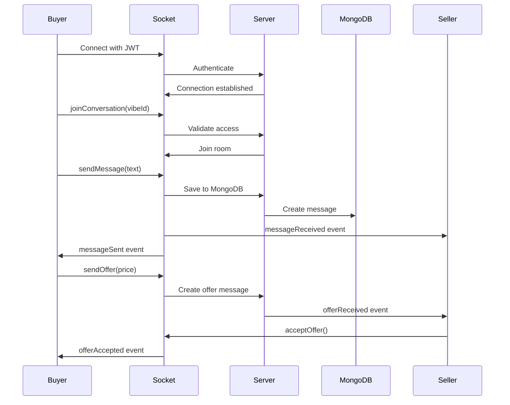
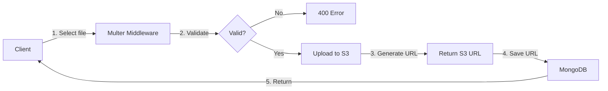
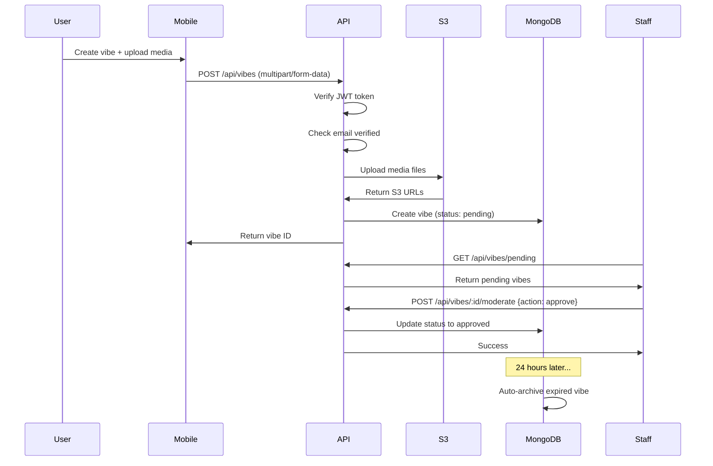
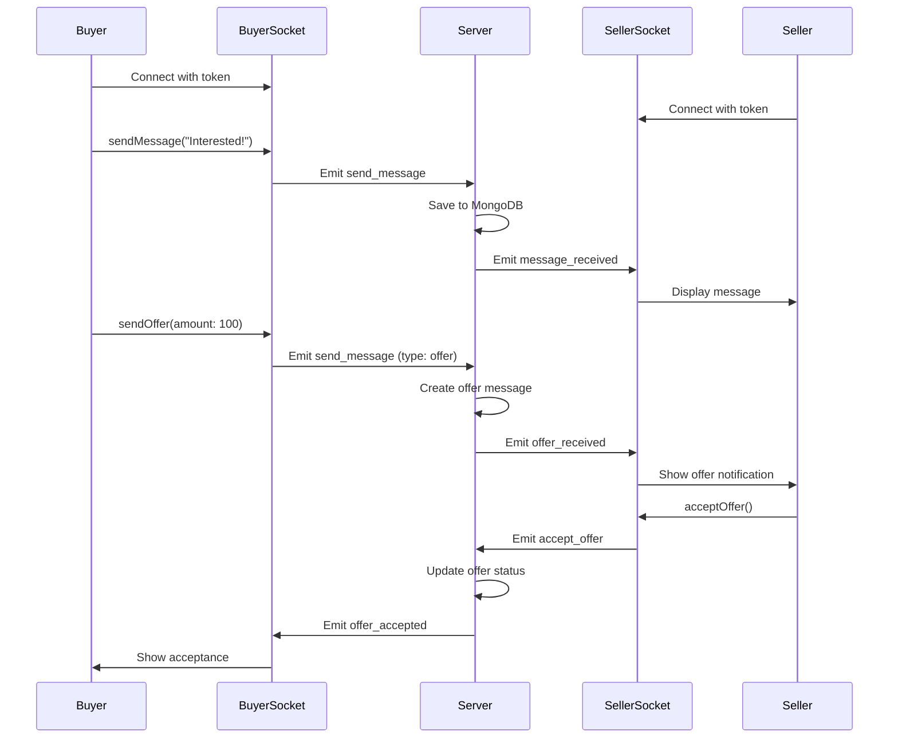
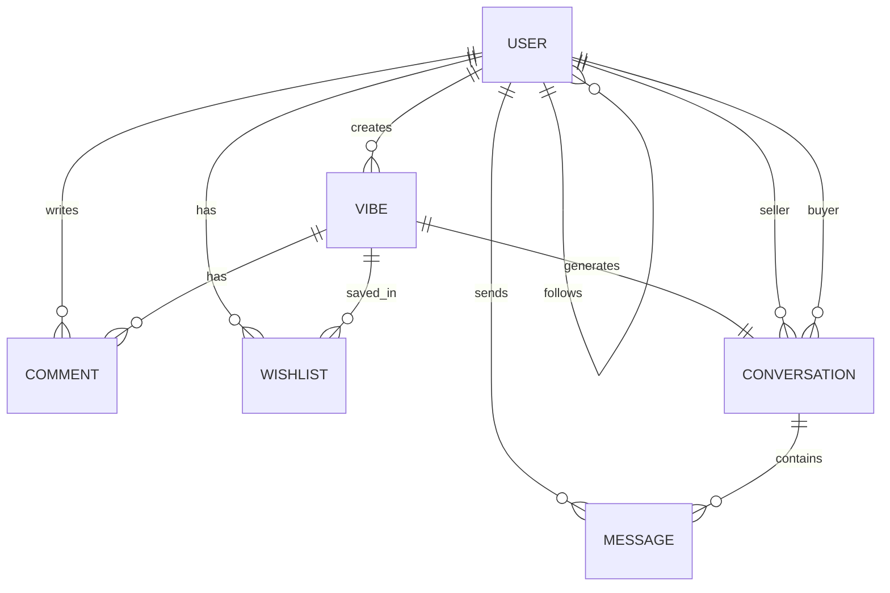

# 🔍 Old Vibes Codebase - Comprehensive Analysis

**Generated:** October 16, 2025  
**Project:** Old Vibes Marketplace  
**Architecture:** Full-Stack Secondhand Marketplace Platform

---

## 📖 Executive Summary

**Old Vibes** is a TikTok-inspired secondhand marketplace platform where users post items as "vibes" (photo/video stories) that expire after 24 hours, creating urgency and dynamic engagement. The platform features real-time chat, staff moderation, social interactions, and is built with a modern tech stack optimized for resource efficiency.

### Key Characteristics
- **Platform Type:** Secondhand Marketplace with Social Features
- **Inspiration:** TikTok-style content + 24-hour expiry mechanism
- **Architecture:** Modular Monolith Backend + Multiple Frontend Clients
- **Team Size:** 4 developers
- **Status:** MVP Complete (July 2025), Enhancement Phase (8 weeks planned)

---

## 🏗️ Architecture Overview

### High-Level Architecture



### Technology Stack

| Layer | Technology | Purpose |
|-------|------------|---------|
| **Runtime** | Bun v1.2.13+ | Ultra-fast JavaScript runtime with native TypeScript |
| **Backend Framework** | Express.js 5.x | RESTful API server |
| **Database** | MongoDB + Mongoose | NoSQL document storage |
| **Cache/Queue** | Redis + ioredis | Sessions, caching, job queue |
| **Real-time** | Socket.io 4.8+ | WebSocket chat communication |
| **Storage** | AWS S3 | Media file storage (images/videos) |
| **Mobile Client** | React Native + Expo | Cross-platform mobile app |
| **Web Client** | Next.js 15 | Server-side rendered web app |
| **Authentication** | JWT + Passport | Token-based auth with Google OAuth |
| **Email** | Nodemailer | Email verification & notifications |
| **Documentation** | Swagger/OpenAPI | Auto-generated API docs |

---

## 📂 Folder Structure & Responsibilities

### `/server` - Backend API Server

**Purpose:** Core business logic, API endpoints, real-time communication, data management

```
server/
├── index.ts                    # Entry point, Express app setup, middleware config
├── config/                     # Configuration files
│   ├── passport.config.ts     # Passport strategies (JWT, Google OAuth)
│   ├── redis.config.ts        # Redis connection setup
│   └── swagger.config.ts      # API documentation config
├── controllers/                # Request handlers (business logic)
│   ├── auth.controllers.ts    # Register, login, logout, email verification
│   ├── vibe.controllers.ts    # Create, read, update, delete vibes
│   ├── user.controllers.ts    # User profiles, follow/unfollow
│   ├── comment.controllers.ts # Comment CRUD operations
│   ├── chat.controllers.ts    # Chat initialization, message history
│   ├── admin.controllers.ts   # Admin panel operations
│   └── wishlist.controllers.ts# Wishlist management
├── models/                     # Database operations (data layer)
│   ├── user.models.ts         # User CRUD, password validation
│   ├── vibe.models.ts         # Vibe CRUD, filtering, trending logic
│   ├── comment.models.ts      # Comment operations
│   └── wishlist.models.ts     # Wishlist operations
├── schema/                     # Mongoose schemas (data structure)
│   ├── user.schema.ts         # User entity definition
│   ├── vibe.schema.ts         # Vibe entity with 24h expiry
│   ├── comment.schema.ts      # Comment entity
│   ├── conversation.schema.ts # Chat conversation entity
│   ├── message.schema.ts      # Chat message entity
│   └── wishlist.schema.ts     # Wishlist entity
├── routes/                     # API route definitions
│   ├── auth.routes.ts         # /api/auth/* endpoints
│   ├── vibe.routes.ts         # /api/vibes/* endpoints
│   ├── user.routes.ts         # /api/users/* endpoints
│   ├── comment.routes.ts      # /api/comments/* endpoints
│   ├── chat.routes.ts         # /api/chat/* endpoints
│   ├── admin.routes.ts        # /api/admin/* endpoints
│   └── wishlist.routes.ts     # /api/wishlist/* endpoints
├── middleware/                 # Request interceptors
│   ├── auth.middleware.ts     # JWT verification, token validation
│   ├── role.middleware.ts     # Role-based access control (admin/staff/user)
│   ├── emailVerification.middleware.ts # Email verification check
│   ├── upload.middleware.ts   # File upload handling (Multer + S3)
│   └── validation.middleware.ts # Request validation
├── services/                   # Business logic services
│   ├── chat.services.ts       # Chat logic, conversation management
│   ├── email.services.ts      # Email sending (verification, notifications)
│   ├── socket.service.ts      # Socket.io real-time chat handler
│   └── verification.services.ts # Email verification token management
├── job/                        # Background jobs
│   └── cleanup.job.ts         # Cron job for archiving expired vibes
├── scripts/                    # Utility scripts
│   ├── seed-data.ts           # Database seeding for development
│   ├── quick-seed.ts          # Quick seed for testing
│   └── USAGE.md               # Script documentation
└── types/                      # TypeScript type definitions
    ├── user.types.ts          # User-related types
    ├── vibe.types.ts          # Vibe-related types
    ├── chat.types.ts          # Chat-related types
    ├── comment.types.ts       # Comment-related types
    ├── wishlist.types.ts      # Wishlist-related types
    └── handler.types.ts       # Generic handler types
```

**Key Responsibilities:**
- ✅ RESTful API endpoints for all entities
- ✅ Real-time WebSocket communication (Socket.io)
- ✅ Authentication & authorization (JWT + OAuth)
- ✅ File upload to AWS S3
- ✅ Email verification & notifications
- ✅ Database operations (CRUD)
- ✅ Background job processing (cron jobs)
- ✅ Staff moderation workflow
- ✅ API documentation (Swagger)

---

### `/client/app` - Mobile Application

**Purpose:** React Native mobile app for iOS and Android using Expo

```
client/app/
├── app/                        # Expo Router file-based routing
│   ├── _layout.tsx            # Root layout with navigation
│   ├── (tabs)/                # Tab-based navigation
│   ├── auth/                  # Login, register screens
│   ├── feed/                  # Main feed of vibes
│   ├── upload/                # Create vibe screen
│   ├── chat/                  # Chat conversations
│   ├── profile/               # User profiles
│   └── settings/              # App settings
├── components/                 # Reusable UI components
│   ├── VibeCard.tsx           # Vibe display component
│   ├── VideoPlayer.tsx        # Video playback
│   ├── ChatBubble.tsx         # Chat message component
│   └── ...
├── api/                        # API client services
│   ├── auth.ts                # Authentication API calls
│   ├── vibes.ts               # Vibe API calls
│   ├── chat.ts                # Chat API calls
│   ├── profile.ts             # Profile API calls
│   └── api.ts                 # Base API configuration
├── contexts/                   # React Context providers
│   ├── AuthContext.tsx        # Authentication state
│   ├── SocketContext.tsx      # Socket.io connection
│   └── ...
├── utils/                      # Utility functions
└── assets/                     # Images, fonts, static files
```

**Key Responsibilities:**
- 📱 Cross-platform mobile experience (iOS/Android)
- 🎥 Video/image capture and upload
- 💬 Real-time chat with Socket.io
- 🔔 Push notifications (planned)
- 📍 Location services
- 🎨 Native UI components with Expo

**Tech Stack:**
- React Native 0.79.5
- Expo SDK ~53.0
- Expo Router (file-based routing)
- Socket.io Client
- React Native Video
- Expo Image Picker
- NativeWind (Tailwind CSS for RN)

---

### `/client/web` - Web Application

**Purpose:** Next.js web application for users and admin panel

```
client/web/
├── app/                        # Next.js App Router
│   ├── layout.tsx             # Root layout
│   ├── page.tsx               # Home page
│   ├── auth/                  # Login, register pages
│   ├── feed/                  # Vibe feed page
│   ├── vibes/[id]/            # Vibe detail page
│   ├── chat/                  # Chat interface
│   ├── search/                # Search page
│   ├── upload/                # Upload vibe page
│   ├── wishlist/              # Wishlist page
│   ├── admin/                 # Admin panel
│   │   ├── dashboard/         # Admin dashboard
│   │   ├── moderation/        # Moderate vibes
│   │   ├── users/             # User management
│   │   └── staff/             # Staff management
│   ├── settings/              # User settings
│   └── verify-email/          # Email verification page
├── _components/                # Reusable React components
├── _sections/                  # Page sections
├── _contexts/                  # React Context providers
├── _apis/                      # API client functions
└── _libs/                      # Utility libraries
```

**Key Responsibilities:**
- 🌐 Web-based user interface
- 👨‍💼 Admin panel for staff moderation
- 📊 Analytics dashboard (planned)
- 🔍 Advanced search functionality
- 💳 Payment integration UI (planned)
- 📱 Responsive design

**Tech Stack:**
- Next.js 15 (App Router)
- React 19
- TailwindCSS
- Socket.io Client
- TypeScript

---

## 🔑 Core Features & Logic

### 1. **Vibes (Items)** - Core Marketplace Logic

**What are Vibes?**
- Items posted for sale with photos/videos
- **24-hour expiry** (like Instagram Stories)
- Must be **approved by staff** before going live
- Support for likes, comments, views tracking
- Automatic archival after expiration

**Vibe Lifecycle:**



**Key Files:**
- `server/schema/vibe.schema.ts` - Data structure with 24h expiry index
- `server/models/vibe.models.ts` - Business logic (CRUD, filtering, trending)
- `server/controllers/vibe.controllers.ts` - API handlers
- `server/routes/vibe.routes.ts` - Route definitions
- `server/job/cleanup.job.ts` - Automatic archival cron job

**Vibe Properties:**
```typescript
interface IVibe {
  userId: ObjectId;              // Owner
  itemName: string;              // Item title
  description: string;           // Max 500 chars
  price: number;                 // Item price
  category: string;              // Category (Electronics, Clothing, etc.)
  condition: 'new' | 'like-new' | 'good' | 'fair' | 'poor';
  tags: string[];                // Search tags
  location?: string;             // Item location
  mediaFiles: {                  // Images/videos
    type: 'image' | 'video';
    url: string;
    thumbnail?: string;
  }[];
  status: 'pending' | 'approved' | 'rejected' | 'sold' | 'archived';
  likes: ObjectId[];             // Users who liked
  comments: ObjectId[];          // Comment references
  views: number;                 // View count
  expiresAt: Date;              // 24h expiry timestamp
}
```

**API Endpoints:**
- `POST /api/vibes` - Create vibe (requires email verification)
- `GET /api/vibes` - Get filtered vibes (with pagination)
- `GET /api/vibes/:vibeId` - Get single vibe
- `PUT /api/vibes/:vibeId` - Update vibe (resets to pending)
- `DELETE /api/vibes/:vibeId` - Delete vibe
- `POST /api/vibes/:vibeId/like` - Like vibe
- `DELETE /api/vibes/:vibeId/like` - Unlike vibe
- `PUT /api/vibes/:vibeId/sold` - Mark as sold
- `GET /api/vibes/trending` - Get trending vibes
- `GET /api/vibes/search` - Search vibes

**Moderation Endpoints (Staff/Admin only):**
- `GET /api/vibes/pending` - Get pending vibes
- `POST /api/vibes/:vibeId/moderate` - Approve/reject vibe

---

### 2. **Authentication & Authorization**

**Multi-Strategy Authentication:**
1. **Local Auth** - Email/password with JWT tokens
2. **Google OAuth 2.0** - Social login with Passport.js

**Authentication Flow:**



**Key Features:**
- JWT token-based authentication
- Refresh token rotation (planned)
- Email verification required for posting
- Role-based access control (admin, staff, user, guest)
- Google OAuth integration
- Password hashing with bcrypt (12 rounds)
- Session management with Redis

**User Roles:**
- **Admin** - Full system access, user management, staff management
- **Staff** - Vibe moderation, user ban/unban
- **User** - Standard marketplace features
- **Guest** - Read-only access (browse without account)

**Key Files:**
- `server/controllers/auth.controllers.ts` - Auth logic
- `server/middleware/auth.middleware.ts` - JWT verification
- `server/middleware/role.middleware.ts` - Role checks
- `server/middleware/emailVerification.middleware.ts` - Email verification
- `server/config/passport.config.ts` - Passport strategies
- `server/services/verification.services.ts` - Verification tokens

---

### 3. **Real-time Chat System**

**Architecture:**
- **Socket.io** for WebSocket connections
- **Conversation-based** chat (linked to specific vibes)
- **Offer system** - Buyers can make offers, sellers accept/reject
- **Message types** - Text, offer, image, system messages

**Chat Flow:**



**Conversation Model:**
```typescript
interface IConversation {
  conversationId: string;        // Deterministic ID (vibe+seller+buyer)
  vibeId: ObjectId;              // Related vibe
  sellerId: ObjectId;            // Seller
  buyerId: ObjectId;             // Buyer
  lastMessage?: string;          // Last message preview
  lastMessageAt?: Date;          // Last activity
  unreadCount: {                 // Unread messages per user
    [userId: string]: number;
  };
}
```

**Message Model:**
```typescript
interface IMessage {
  conversationId: string;
  senderId: ObjectId;
  receiverId: ObjectId;
  vibeId: ObjectId;
  messageType: 'text' | 'offer' | 'image' | 'system';
  content?: string;
  offerData?: {                  // For offer messages
    amount: number;
    status: 'pending' | 'accepted' | 'rejected' | 'expired';
    expiresAt: Date;
  };
  isRead: boolean;
  readAt?: Date;
}
```

**Socket.io Events:**
- `connection` - Client connects
- `joinConversation` - Join conversation room
- `sendMessage` - Send message
- `messageReceived` - Receive message
- `typing` - Typing indicator
- `markAsRead` - Mark messages as read
- `userOnline` - User comes online
- `userOffline` - User goes offline

**Key Files:**
- `server/services/socket.service.ts` - Socket.io handler
- `server/services/chat.services.ts` - Chat business logic
- `server/schema/conversation.schema.ts` - Conversation model
- `server/schema/message.schema.ts` - Message model
- `server/controllers/chat.controllers.ts` - REST API for chat history

---

### 4. **Media Upload & Storage**

**AWS S3 Integration:**
- Direct upload to S3 bucket
- Multer + multer-s3 middleware
- Organized folder structure
- Support for images and videos

**Upload Flow:**



**File Organization:**
```
s3://bucket-name/
├── profiles/          # Profile pictures
│   └── {userId}.jpg
├── vibes/             # Vibe media
│   ├── images/
│   │   └── {vibeId}_{timestamp}.jpg
│   └── videos/
│       └── {vibeId}_{timestamp}.mp4
└── chat/              # Chat attachments
    └── {conversationId}/
        └── {messageId}_{timestamp}.jpg
```

**Upload Validation:**
- **Max file size:** 10MB
- **Allowed types:** image/jpeg, image/png, video/mp4
- **Virus scanning:** Planned
- **Compression:** Planned (FFmpeg service)

**Key Files:**
- `server/middleware/upload.middleware.ts` - S3 upload handler
- Environment variables for AWS credentials

**Planned Enhancement (Sprint 1):**
- Video compression service (FFmpeg)
- Image optimization (Sharp)
- Thumbnail generation
- Multiple quality variants

---

### 5. **Moderation System**

**Staff Workflow:**
1. User creates vibe → Status: `pending`
2. Staff reviews in admin panel
3. Staff approves/rejects with notes
4. Approved vibes go live immediately
5. Rejected vibes return to user with feedback

**Moderation Actions:**
```typescript
interface ModerationAction {
  action: 'approve' | 'reject';
  notes?: string;              // Feedback for user
}
```

**Admin Panel Features:**
- View all pending vibes
- View user details and history
- Ban/unban users
- Manage staff accounts
- View system statistics

**API Endpoints:**
- `GET /api/vibes/pending` - Get pending vibes (staff only)
- `POST /api/vibes/:vibeId/moderate` - Moderate vibe
- `POST /api/admin/users/:userId/ban` - Ban user
- `POST /api/admin/staff` - Create staff account

**Key Files:**
- `server/controllers/admin.controllers.ts` - Admin operations
- `server/routes/admin.routes.ts` - Admin routes
- `server/middleware/role.middleware.ts` - Role validation

---

### 6. **Social Features**

**User Interactions:**
- **Follow/Unfollow** users
- **Like/Unlike** vibes
- **Comment** on vibes
- **Reply** to comments
- **View** user profiles
- **Track** followers/following

**Comment System:**
```typescript
interface IComment {
  vibeId: ObjectId;
  userId: ObjectId;
  content: string;
  parentCommentId?: ObjectId;    // For replies
  likes: ObjectId[];
  createdAt: Date;
}
```

**User Profile:**
```typescript
interface IUser {
  email: string;
  username: string;
  name: string;
  bio?: string;
  profilePicture?: string;
  followers: ObjectId[];         // Who follows this user
  following: ObjectId[];         // Who this user follows
  isVerified: boolean;           // Badge
}
```

**API Endpoints:**
- `POST /api/users/:userId/follow` - Follow user
- `DELETE /api/users/:userId/follow` - Unfollow
- `GET /api/users/:userId/followers` - Get followers
- `GET /api/users/:userId/following` - Get following
- `POST /api/comments` - Create comment
- `GET /api/comments/:vibeId` - Get vibe comments
- `POST /api/comments/:commentId/like` - Like comment

---

### 7. **Wishlist System**

**Purpose:** Users can save vibes they're interested in

**Features:**
- Add/remove vibes to wishlist
- Wishlist items also expire after 24 hours
- Automatic cleanup

**Wishlist Model:**
```typescript
interface IWishlist {
  userId: ObjectId;
  vibeId: ObjectId;
  expiresAt: Date;               // 24h expiry (same as vibe)
}
```

**API Endpoints:**
- `POST /api/wishlist` - Add to wishlist
- `DELETE /api/wishlist/:vibeId` - Remove from wishlist
- `GET /api/wishlist` - Get user's wishlist

**Key Files:**
- `server/schema/wishlist.schema.ts`
- `server/controllers/wishlist.controllers.ts`
- `server/routes/wishlist.routes.ts`

---

## 🔄 Data Flow Examples

### Example 1: Creating a Vibe



### Example 2: Real-time Chat



---

## 🗄️ Database Schema Overview

### Collections

1. **users** - User accounts and profiles
2. **vibes** - Items for sale
3. **comments** - Comments on vibes
4. **conversations** - Chat conversations
5. **messages** - Chat messages
6. **wishlists** - User wishlists

### Key Relationships



### Indexes

**Performance-Critical Indexes:**
- `vibes.expiresAt` - TTL index for automatic cleanup
- `vibes.status` - Filter approved vibes
- `vibes.userId` - User's vibes
- `users.email` - Login lookup
- `users.username` - Profile lookup
- `conversations.conversationId` - Chat lookup
- `messages.conversationId` - Message history

---

## 🔐 Security Implementation

### Authentication Security
- ✅ JWT tokens with expiry
- ✅ bcrypt password hashing (12 rounds)
- ✅ HTTP-only cookies for web (planned)
- ✅ Token refresh mechanism (planned)
- ✅ Rate limiting on auth endpoints

### Authorization
- ✅ Role-based access control (RBAC)
- ✅ Resource ownership validation
- ✅ Email verification requirement
- ✅ Staff-only moderation endpoints

### Data Security
- ✅ Input validation with express-validator
- ✅ NoSQL injection prevention (Mongoose sanitization)
- ✅ CORS configuration
- ✅ Helmet.js security headers
- ⏳ File upload virus scanning (planned)

### API Security
- ✅ Rate limiting (15 min / 100 requests)
- ✅ Request size limits
- ✅ HTTPS enforcement (production)
- ⏳ API key rotation (planned)

---

## 🚀 Planned Enhancements

### Sprint 1: Foundation & Compression (Weeks 1-2)
- [ ] FFmpeg video compression service
- [ ] Image optimization (Sharp/WebP)
- [ ] Thumbnail generation
- [ ] Compression queue with Bull

### Sprint 2: Payment & VIP System (Weeks 3-4)
- [ ] VNPay integration (Vietnam)
- [ ] PayOS integration (Vietnam)
- [ ] Stripe integration (International)
- [ ] VIP promotion feature (boost vibes)
- [ ] Payment history tracking

### Sprint 3: Reviews & Recommendations (Weeks 5-6)
- [ ] Seller review/rating system
- [ ] Trust score calculation
- [ ] Location-based recommendations
- [ ] Tag-based recommendations
- [ ] Trending algorithm improvement

### Sprint 4: AI Integration & Polish (Weeks 7-8)
- [ ] Google Gemini API integration
- [ ] RAG for auto-descriptions
- [ ] Content moderation AI
- [ ] Smart search with embeddings
- [ ] Performance optimization

---

## 🛠️ Development Workflow

### Local Development Setup

```bash
# Backend
cd server
bun install
cp .env.example .env
# Configure environment variables
bun run dev  # Runs on port 4000

# Web Client
cd client/web
pnpm install
pnpm dev  # Runs on port 3000

# Mobile App
cd client/app
bun install
bunx expo start
```

### Environment Variables

**Backend (server/.env):**
```bash
# Database
MONGO_URI=mongodb://localhost:27017
DB_NAME=oldvibes

# Server
PORT=4000
NODE_ENV=development

# JWT
JWT_SECRET=your-secret-key
SESSION_SECRET=your-session-secret

# Redis
REDIS_HOST=localhost
REDIS_PORT=6379

# AWS S3
AWS_ACCESS_KEY_ID=your-key
AWS_SECRET_ACCESS_KEY=your-secret
AWS_REGION=ap-southeast-1
AWS_S3_BUCKET_NAME=oldvibes-media

# Email
SMTP_HOST=smtp.gmail.com
SMTP_PORT=587
SMTP_USER=your-email@gmail.com
SMTP_PASS=your-app-password
```

### Useful Scripts

```bash
# Backend
bun run dev              # Development server with watch mode
bun run start            # Production server
bun run seed             # Seed database with test data
bun run seed:quick       # Quick seed for testing

# Frontend
pnpm dev                 # Next.js dev server
pnpm build               # Production build
bunx expo start          # Expo dev server
bunx expo start --android # Run on Android
bunx expo start --ios    # Run on iOS
```

---

## 📊 API Documentation

### Swagger Documentation
Access interactive API docs at: `http://localhost:4000/api-docs`

### Authentication Endpoints

| Method | Endpoint | Description | Auth Required |
|--------|----------|-------------|---------------|
| POST | /api/auth/register | Register new user | No |
| POST | /api/auth/login | Login user | No |
| POST | /api/auth/logout | Logout user | Yes |
| GET | /api/auth/me | Get current user | Yes |
| POST | /api/auth/verify-email | Verify email | No |
| POST | /api/auth/resend-verification | Resend verification | Yes |
| GET | /api/auth/google | Google OAuth login | No |
| GET | /api/auth/google/callback | Google OAuth callback | No |

### Vibe Endpoints

| Method | Endpoint | Description | Auth Required | Role |
|--------|----------|-------------|---------------|------|
| POST | /api/vibes | Create vibe | Yes | User + Email Verified |
| GET | /api/vibes | Get vibes (filtered) | Optional | Any |
| GET | /api/vibes/:id | Get vibe by ID | Optional | Any |
| PUT | /api/vibes/:id | Update vibe | Yes | Owner |
| DELETE | /api/vibes/:id | Delete vibe | Yes | Owner/Admin |
| POST | /api/vibes/:id/like | Like vibe | Yes | User |
| DELETE | /api/vibes/:id/like | Unlike vibe | Yes | User |
| GET | /api/vibes/trending | Get trending vibes | Optional | Any |
| GET | /api/vibes/search | Search vibes | Optional | Any |
| PUT | /api/vibes/:id/sold | Mark as sold | Yes | Owner |
| GET | /api/vibes/pending | Get pending vibes | Yes | Staff/Admin |
| POST | /api/vibes/:id/moderate | Moderate vibe | Yes | Staff/Admin |

### User Endpoints

| Method | Endpoint | Description | Auth Required |
|--------|----------|-------------|---------------|
| GET | /api/users/:id | Get user profile | Optional |
| PUT | /api/users/profile | Update own profile | Yes |
| POST | /api/users/:id/follow | Follow user | Yes |
| DELETE | /api/users/:id/follow | Unfollow user | Yes |
| GET | /api/users/:id/followers | Get followers | Optional |
| GET | /api/users/:id/following | Get following | Optional |

### Chat Endpoints

| Method | Endpoint | Description | Auth Required |
|--------|----------|-------------|---------------|
| POST | /api/chat/start | Start conversation | Yes |
| GET | /api/chat/conversations | Get user conversations | Yes |
| GET | /api/chat/:conversationId/messages | Get messages | Yes |
| POST | /api/chat/:conversationId/messages | Send message | Yes |
| PUT | /api/chat/:conversationId/read | Mark as read | Yes |

---

## 🎯 Key Design Decisions

### 1. **Why 24-Hour Expiry?**
- Creates **urgency** and **FOMO** (fear of missing out)
- Encourages **quick transactions**
- Reduces **clutter** and outdated listings
- Similar to Instagram Stories model
- Automatic cleanup reduces storage costs

### 2. **Why Staff Moderation?**
- **Quality control** - Prevents spam and low-quality posts
- **Trust building** - Users know items are reviewed
- **Safety** - Catches prohibited items
- **Brand protection** - Maintains platform reputation

### 3. **Why Modular Monolith?**
- **Simpler deployment** - Single server for MVP
- **Lower costs** - Fits in t2.micro budget
- **Team size** - 4 developers can manage easily
- **Future-ready** - Can extract services later

### 4. **Why Socket.io for Chat?**
- **Real-time** - Instant message delivery
- **Fallback support** - Works with older browsers
- **Built-in rooms** - Easy conversation isolation
- **TypeScript support** - Type-safe events

### 5. **Why MongoDB?**
- **Flexible schema** - Rapid development
- **Embedded documents** - Reduce joins
- **TTL indexes** - Automatic expiry
- **Aggregation pipeline** - Complex queries

---

## 🐛 Known Issues & Limitations

### Current Limitations
1. **No video compression** - Large video uploads slow
2. **No push notifications** - Mobile notifications not implemented
3. **No payment integration** - Manual payment flow
4. **Basic search** - No full-text search or fuzzy matching
5. **No analytics** - Limited tracking and insights
6. **No real-time notifications** - Only chat is real-time

### Technical Debt
- Missing comprehensive test coverage
- No CI/CD automated testing
- No monitoring/alerting system
- No backup strategy documented
- Redis not clustered for HA

---

## 📈 Performance Considerations

### Database Optimization
- Indexes on frequently queried fields
- Pagination for large result sets
- Lean queries where possible
- Connection pooling

### Caching Strategy
- User sessions in Redis
- API response caching (planned)
- Static asset CDN (planned)

### Media Optimization
- S3 CloudFront CDN (planned)
- Image thumbnails (planned)
- Video transcoding (planned)
- Lazy loading images

---

## 🤝 Team Collaboration

### Git Workflow
- **main** branch - Production-ready code
- **develop** branch - Integration branch
- **feature/** - Feature branches
- **bugfix/** - Bug fix branches

### Code Review Process
1. Create feature branch
2. Implement feature
3. Submit pull request
4. Code review by team
5. Merge to develop
6. QA testing
7. Merge to main

---

## 📝 Conclusion

Old Vibes is a well-architected secondhand marketplace with a unique 24-hour expiry mechanism that creates urgency and engagement. The platform combines:

- **Modern tech stack** (Bun, Express, Next.js, React Native)
- **Real-time features** (Socket.io chat)
- **Social elements** (likes, comments, follow)
- **Quality control** (staff moderation)
- **Scalable architecture** (ready for microservices)

The codebase is organized, type-safe with TypeScript, and follows best practices. The planned enhancements will add media compression, payment integration, AI features, and recommendations to create a competitive marketplace platform.

---

**Last Updated:** October 16, 2025  
**Analyzed By:** AI Code Analysis System
