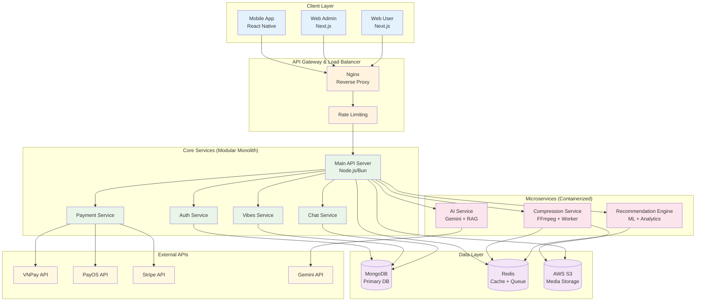

# Old Vibes Platform - System Architecture & Technology Stack

**Project**: Old Vibes Marketplace  
**Architecture**: Resource-Optimized Microservices  
**Deployment**: AWS EC2 t2.micro (1GB RAM, 1 vCPU)  
**Budget**: Minimal Cost, Maximum Performance

---

## 🏗️ Executive Summary

This document outlines the system architecture for Old Vibes platform extension, designed for resource efficiency while maintaining scalability. The architecture balances microservices benefits with monolithic simplicity, optimized for university project constraints with professional-grade results.

### Architecture Philosophy

- **Modular Monolith**: Core services in single deployment
- **Selective Microservices**: Heavy operations in separate containers
- **Event-Driven**: Async processing for non-critical operations
- **Cache-First**: Aggressive caching for performance
- **Cost-Conscious**: Minimize external service costs

---

## 🎯 System Overview



---

## 🛠️ Technology Stack

### Core Technologies

#### Backend Framework

```yaml
Primary: Node.js with Bun runtime
  - Ultra-fast JavaScript runtime
  - Built-in bundler and package manager
  - TypeScript native support
  - Memory efficient (crucial for t2.micro)

Alternative: Node.js with Express
  - Fallback for compatibility
  - Extensive ecosystem
  - Team familiarity
```

#### Database Stack

```yaml
Primary Database: MongoDB
  - Document-oriented (matches existing schema)
  - Flexible schema evolution
  - Built-in replication support
  - Aggregation pipeline for analytics

Caching Layer: Redis
  - Session storage
  - Job queue management
  - Real-time data caching
  - Pub/Sub for real-time features

Storage: AWS S3
  - Media file storage
  - CDN integration
  - Versioning support
  - Cost-effective scaling
```

### Specialized Services

#### Media Compression Service

```dockerfile
# Compression Service Container
FROM node:18-alpine
RUN apk add --no-cache ffmpeg
WORKDIR /app
COPY package.json .
RUN npm install
COPY . .
EXPOSE 3001
CMD ["node", "compression-worker.js"]
```

**Technology Choices:**

- **FFmpeg**: Industry standard for media processing
- **Sharp**: Node.js image processing (memory efficient)
- **Bull Queue**: Redis-based job queue
- **WebP/AVIF**: Modern image formats (better compression)

#### AI & RAG Service

```yaml
RAG Stack:
  - Vector Database: ChromaDB (lightweight, self-hosted)
  - Embeddings: OpenAI text-embedding-ada-002
  - LLM: Google Gemini 1.5 Pro
  - Framework: LangChain (Node.js)

Deployment:
  - Containerized service
  - Auto-scaling based on queue depth
  - Request caching to minimize API calls
```

#### Payment Integration

```typescript
interface PaymentProvider {
  vnpay: {
    domestic: true;
    fees: "2.5%";
    integration: "REST API";
    currencies: ["VND"];
  };
  payos: {
    domestic: true;
    fees: "2.0%";
    integration: "SDK";
    currencies: ["VND"];
  };
  stripe: {
    international: true;
    fees: "3.4% + 30¢";
    integration: "SDK";
    currencies: ["USD", "EUR", "VND"];
  };
}
```

---

## 🏗️ Detailed Architecture Components

### 1. API Gateway Layer

#### Nginx Configuration

```nginx
upstream api_backend {
    server api:3000 weight=1 max_fails=3 fail_timeout=30s;
}

upstream compression_backend {
    server compression:3001 weight=1 max_fails=3 fail_timeout=30s;
}

server {
    listen 80;
    server_name oldvibes.com;

    # Rate limiting
    limit_req_zone $binary_remote_addr zone=api:10m rate=10r/s;
    limit_req_zone $binary_remote_addr zone=upload:10m rate=2r/s;

    # API routes
    location /api/ {
        limit_req zone=api burst=20 nodelay;
        proxy_pass http://api_backend;
        proxy_set_header Host $host;
        proxy_set_header X-Real-IP $remote_addr;
    }

    # Media upload routes
    location /api/upload {
        limit_req zone=upload burst=5 nodelay;
        client_max_body_size 100M;
        proxy_pass http://compression_backend;
    }

    # Static files with aggressive caching
    location /static/ {
        expires 1y;
        add_header Cache-Control "public, immutable";
        alias /app/static/;
    }
}
```

### 2. Core Services Architecture

#### Modular Monolith Structure

```
src/
├── modules/
│   ├── auth/
│   │   ├── auth.controller.ts
│   │   ├── auth.service.ts
│   │   ├── auth.middleware.ts
│   │   └── auth.routes.ts
│   ├── vibes/
│   │   ├── vibes.controller.ts
│   │   ├── vibes.service.ts
│   │   ├── vibes.queue.ts
│   │   └── vibes.routes.ts
│   ├── chat/
│   │   ├── chat.controller.ts
│   │   ├── chat.service.ts
│   │   ├── socket.handler.ts
│   │   └── chat.routes.ts
│   └── payments/
│       ├── payment.controller.ts
│       ├── providers/
│       │   ├── vnpay.service.ts
│       │   ├── payos.service.ts
│       │   └── stripe.service.ts
│       └── payment.routes.ts
├── shared/
│   ├── database/
│   ├── cache/
│   ├── queue/
│   └── utils/
└── app.ts
```

#### Service Communication Pattern

```typescript
// Event-driven architecture for loose coupling
class EventBus {
  private static instance: EventEmitter = new EventEmitter();

  static emit(event: string, data: any) {
    this.instance.emit(event, data);
  }

  static on(event: string, handler: Function) {
    this.instance.on(event, handler);
  }
}

// Usage example
VibeService.create(vibe).then(() => {
  EventBus.emit("vibe.created", { vibeId, userId });
});

// Listeners
EventBus.on("vibe.created", CompressionService.queueCompression);
EventBus.on("vibe.created", RecommendationService.updateUserProfile);
EventBus.on("payment.completed", VibeService.promoteVibe);
```

### 3. Database Design & Optimization

#### MongoDB Schema Design

```typescript
// Optimized for read performance and resource constraints
interface OptimizedVibeSchema {
  _id: ObjectId;
  userId: ObjectId;
  itemName: string;
  description: string;
  price: number;

  // Denormalized for performance
  userInfo: {
    username: string;
    avatar: string;
    rating: number;
  };

  // Compressed media references
  media: {
    original: string;
    compressed: string;
    thumbnail: string;
    formats: ["webp", "jpeg"];
  }[];

  // Analytics optimized
  stats: {
    views: number;
    likes: number;
    comments: number;
    lastViewed: Date;
  };

  // Recommendation data
  vectors: {
    tags: string[];
    location: GeoPoint;
    category: string;
    priceRange: "low" | "medium" | "high";
  };

  // Efficient indexing
  createdAt: Date;
  expiresAt: Date;
}

// Strategic indexes for performance
db.vibes.createIndex({ createdAt: -1 }); // Recent posts
db.vibes.createIndex({ "vectors.location": "2dsphere" }); // Geo queries
db.vibes.createIndex({ "vectors.tags": 1 }); // Tag matching
db.vibes.createIndex({ "stats.views": -1 }); // Trending
db.vibes.createIndex({ expiresAt: 1 }, { expireAfterSeconds: 0 }); // TTL
```

#### Redis Caching Strategy

```typescript
interface CacheStrategy {
  // User sessions (1 hour TTL)
  sessions: `session:${userId}`;

  // API responses (5 minutes TTL)
  api: `api:${endpoint}:${hash}`;

  // Recommendation cache (30 minutes TTL)
  recommendations: `rec:${userId}:${page}`;

  // Real-time data (1 minute TTL)
  trending: `trending:${category}`;

  // Job queues (persistent)
  queues: {
    compression: "queue:compression";
    ai: "queue:ai";
    notifications: "queue:notifications";
  };
}

class CacheService {
  static async getOrSet<T>(
    key: string,
    fetcher: () => Promise<T>,
    ttl: number = 300
  ): Promise<T> {
    const cached = await redis.get(key);
    if (cached) return JSON.parse(cached);

    const data = await fetcher();
    await redis.setex(key, ttl, JSON.stringify(data));
    return data;
  }
}
```

### 4. Microservices Implementation

#### Compression Service Architecture

```yaml
Service: Media Compression Worker
Container: compression-service
Resource Limits:
  memory: 256MB
  cpu: 0.5 cores

Processing Pipeline: 1. Receive job from Redis queue
  2. Download original file from S3
  3. Process with FFmpeg/Sharp
  4. Upload compressed versions
  5. Update database with new URLs
  6. Send completion notification

Optimization Strategies:
  - Process in batches to amortize startup costs
  - Use streaming to minimize memory usage
  - Implement circuit breaker for S3 failures
  - Queue-based backpressure handling
```

#### AI Service Architecture

```yaml
Service: AI & RAG Processing
Container: ai-service
Resource Limits:
  memory: 200MB
  cpu: 0.3 cores

Components:
  - ChromaDB: Lightweight vector storage
  - LangChain: RAG orchestration
  - Gemini API: LLM processing
  - Custom embeddings: Product categorization

Cost Optimization:
  - Request deduplication
  - Response caching (24h TTL)
  - Batch processing for similar requests
  - Fallback to template responses
```

#### Recommendation Engine

```yaml
Service: Recommendation System
Container: recommendation-service
Resource Limits:
  memory: 300MB
  cpu: 0.4 cores

Algorithm Stack:
  - Collaborative Filtering: User behavior similarity
  - Content-Based: Tag and category matching
  - Geographic: Location-based proximity
  - Hybrid: Weighted combination of above

Real-time Updates:
  - User action tracking via events
  - Incremental model updates
  - A/B testing framework
  - Performance monitoring
```

---

## 🔧 Development & Deployment

### Docker Compose Configuration

```yaml
version: "3.8"
services:
  nginx:
    image: nginx:alpine
    ports:
      - "80:80"
      - "443:443"
    volumes:
      - ./nginx.conf:/etc/nginx/nginx.conf
    depends_on:
      - api

  api:
    build: .
    environment:
      - NODE_ENV=production
      - MONGODB_URI=${MONGODB_URI}
      - REDIS_URL=${REDIS_URL}
    depends_on:
      - mongodb
      - redis
    deploy:
      resources:
        limits:
          memory: 400M
          cpus: "0.6"

  compression:
    build: ./services/compression
    environment:
      - REDIS_URL=${REDIS_URL}
      - AWS_S3_BUCKET=${AWS_S3_BUCKET}
    depends_on:
      - redis
    deploy:
      resources:
        limits:
          memory: 256M
          cpus: "0.5"

  ai-service:
    build: ./services/ai
    environment:
      - GEMINI_API_KEY=${GEMINI_API_KEY}
      - REDIS_URL=${REDIS_URL}
    depends_on:
      - redis
    deploy:
      resources:
        limits:
          memory: 200M
          cpus: "0.3"

  mongodb:
    image: mongo:6-jammy
    volumes:
      - mongodb_data:/data/db
    deploy:
      resources:
        limits:
          memory: 200M
          cpus: "0.2"

  redis:
    image: redis:7-alpine
    volumes:
      - redis_data:/data
    deploy:
      resources:
        limits:
          memory: 50M
          cpus: "0.1"

volumes:
  mongodb_data:
  redis_data:
```

### Resource Allocation for t2.micro

```yaml
Total Available: 1GB RAM, 1 vCPU, 8GB Storage

Allocation Strategy:
  System Overhead: 100MB RAM, 0.1 CPU
  Nginx: 50MB RAM, 0.1 CPU
  Main API: 400MB RAM, 0.6 CPU
  Compression Service: 256MB RAM, 0.5 CPU (on-demand)
  AI Service: 200MB RAM, 0.3 CPU (on-demand)
  MongoDB: 200MB RAM, 0.2 CPU
  Redis: 50MB RAM, 0.1 CPU

Buffer: ~144MB RAM for burst capacity
```

### CI/CD Pipeline

```yaml
# .github/workflows/deploy.yml
name: Deploy to Production

on:
  push:
    branches: [main]

jobs:
  test:
    runs-on: ubuntu-latest
    steps:
      - uses: actions/checkout@v3
      - uses: actions/setup-node@v3
        with:
          node-version: "18"
      - run: npm ci
      - run: npm test
      - run: npm run lint

  build:
    needs: test
    runs-on: ubuntu-latest
    steps:
      - uses: actions/checkout@v3
      - uses: docker/build-push-action@v3
        with:
          push: true
          tags: ${{ secrets.DOCKER_REGISTRY }}/oldvibes:${{ github.sha }}

  deploy:
    needs: build
    runs-on: ubuntu-latest
    steps:
      - name: Deploy to EC2
        uses: appleboy/ssh-action@v0.1.5
        with:
          host: ${{ secrets.EC2_HOST }}
          username: ec2-user
          key: ${{ secrets.EC2_PRIVATE_KEY }}
          script: |
            docker-compose pull
            docker-compose up -d --remove-orphans
            docker system prune -f
```

---

## 💰 Cost Analysis & Optimization

### Infrastructure Costs (Monthly)

```yaml
AWS EC2 t2.micro: $0 (Free Tier)
AWS S3 Storage: ~$5-15 (5-50GB)
AWS Data Transfer: ~$2-8 (20-100GB)
Domain & SSL: ~$12/year
External APIs:
  - Gemini API: ~$10-30 (token usage)
  - Payment Processing: 2.5% transaction fee

Total Monthly Cost: ~$17-53 USD
Annual Cost: ~$200-640 USD
```

### Performance Optimizations for Limited Resources

#### Memory Optimization

```typescript
// Streaming for large file processing
const processVideo = async (inputStream: Readable) => {
  return new Promise((resolve, reject) => {
    ffmpeg(inputStream)
      .videoCodec("libx264")
      .audioCodec("aac")
      .size("720x1280")
      .videoBitrate("1000k")
      .stream()
      .pipe(outputStream);
  });
};

// Connection pooling
const mongoOptions = {
  maxPoolSize: 5, // Limit concurrent connections
  serverSelectionTimeoutMS: 5000,
  socketTimeoutMS: 45000,
  bufferMaxEntries: 0,
};

// Redis connection optimization
const redisOptions = {
  maxRetriesPerRequest: 3,
  retryDelayOnFailover: 100,
  lazyConnect: true,
  keepAlive: 30000,
};
```

#### CPU Optimization

```typescript
// Async processing to prevent blocking
const processCompressionQueue = async () => {
  const jobs = await Queue.getJobs(["waiting"], 0, 4); // Batch of 5

  await Promise.all(
    jobs.map((job) =>
      processJob(job).catch((err) => {
        logger.error(`Job ${job.id} failed:`, err);
        job.moveToFailed(err);
      })
    )
  );
};

// Circuit breaker for external APIs
class CircuitBreaker {
  private failures = 0;
  private threshold = 5;
  private timeout = 60000;
  private state: "CLOSED" | "OPEN" | "HALF_OPEN" = "CLOSED";

  async call<T>(fn: () => Promise<T>): Promise<T> {
    if (this.state === "OPEN") {
      throw new Error("Circuit breaker is OPEN");
    }

    try {
      const result = await fn();
      this.onSuccess();
      return result;
    } catch (error) {
      this.onFailure();
      throw error;
    }
  }
}
```

---

## 🔐 Security Architecture

### Authentication & Authorization

```typescript
interface SecurityLayers {
  authentication: {
    jwt: {
      algorithm: "RS256";
      expiry: "15m"; // Short-lived access tokens
      refresh: "7d"; // Longer refresh tokens
    };
    sessions: {
      store: "redis";
      httpOnly: true;
      secure: true;
      sameSite: "strict";
    };
  };

  authorization: {
    rbac: ["admin", "staff", "user", "guest"];
    permissions: {
      "vibes.create": ["user", "staff", "admin"];
      "vibes.moderate": ["staff", "admin"];
      "payments.process": ["user", "staff", "admin"];
      "users.manage": ["admin"];
    };
  };

  encryption: {
    passwords: "bcrypt"; // Salt rounds: 12
    sensitive_data: "AES-256-GCM";
    api_keys: "environment_variables";
  };
}
```

### Input Validation & Sanitization

```typescript
// Comprehensive validation middleware
const validateVibeCreation = [
  body("itemName").isLength({ min: 3, max: 100 }).trim().escape(),
  body("description").isLength({ min: 10, max: 500 }).trim().escape(),
  body("price").isFloat({ min: 0, max: 1000000 }).toFloat(),
  body("tags")
    .isArray({ min: 1, max: 10 })
    .custom((tags) =>
      tags.every((tag) => typeof tag === "string" && tag.length <= 20)
    ),
  (req: Request, res: Response, next: NextFunction) => {
    const errors = validationResult(req);
    if (!errors.isEmpty()) {
      return res.status(400).json({ errors: errors.array() });
    }
    next();
  },
];
```

### Rate Limiting Strategy

```typescript
const rateLimitConfig = {
  // API endpoints
  general: {
    windowMs: 15 * 60 * 1000, // 15 minutes
    max: 100, // 100 requests per window
    message: "Too many requests, please try again later",
  },

  // Authentication endpoints
  auth: {
    windowMs: 15 * 60 * 1000,
    max: 5, // 5 login attempts per window
    skipSuccessfulRequests: true,
  },

  // File upload endpoints
  upload: {
    windowMs: 60 * 60 * 1000, // 1 hour
    max: 20, // 20 uploads per hour
    standardHeaders: true,
    legacyHeaders: false,
  },

  // Payment endpoints
  payment: {
    windowMs: 60 * 60 * 1000,
    max: 10, // 10 payment attempts per hour
    skipSuccessfulRequests: true,
  },
};
```

---

## 📊 Monitoring & Analytics

### Application Performance Monitoring

```typescript
// Custom lightweight monitoring
class PerformanceMonitor {
  private metrics = new Map<string, number[]>();

  track(operation: string, duration: number) {
    const key = `${operation}:${new Date().getHours()}`;
    const values = this.metrics.get(key) || [];
    values.push(duration);
    this.metrics.set(key, values.slice(-100)); // Keep last 100 samples
  }

  getStats(operation: string) {
    const key = `${operation}:${new Date().getHours()}`;
    const values = this.metrics.get(key) || [];

    return {
      count: values.length,
      avg: values.reduce((a, b) => a + b, 0) / values.length,
      p95: this.percentile(values, 95),
      p99: this.percentile(values, 99),
    };
  }
}

// Health check endpoints
app.get("/health", async (req, res) => {
  const health = {
    uptime: process.uptime(),
    memory: process.memoryUsage(),
    timestamp: Date.now(),
    services: {
      mongodb: await checkMongoDB(),
      redis: await checkRedis(),
      s3: await checkS3(),
    },
  };

  const isHealthy = Object.values(health.services).every(Boolean);
  res.status(isHealthy ? 200 : 503).json(health);
});
```

### Business Analytics

```typescript
// Event tracking for business metrics
class AnalyticsService {
  static trackEvent(event: string, userId: string, properties: object) {
    const data = {
      event,
      userId,
      properties,
      timestamp: new Date(),
      sessionId: req.sessionID,
    };

    // Store in MongoDB for analysis
    Analytics.create(data);

    // Send to Redis for real-time dashboards
    redis.lpush("analytics:events", JSON.stringify(data));
  }
}

// Usage examples
AnalyticsService.trackEvent("vibe.created", userId, {
  category: vibe.category,
  price: vibe.price,
  hasVideo: vibe.mediaFiles.some((m) => m.type === "video"),
});

AnalyticsService.trackEvent("payment.completed", userId, {
  amount: payment.amount,
  provider: payment.provider,
  promotionTier: payment.tier,
});
```

---

## 🚀 Scalability & Future Considerations

### Horizontal Scaling Strategy

```yaml
Phase 1 (Current): Single Instance
  - Modular monolith on t2.micro
  - Vertical scaling within instance limits
  - Aggressive caching and optimization

Phase 2 (Growth): Multi-Instance
  - Load balancer (Application Load Balancer)
  - Stateless application design
  - Shared Redis and MongoDB clusters

Phase 3 (Scale): Microservices
  - Service mesh (Istio/Linkerd)
  - Container orchestration (EKS)
  - Distributed caching and databases

Phase 4 (Global): Multi-Region
  - CDN integration (CloudFront)
  - Database replication
  - Edge computing for media processing
```

### Technology Migration Path

```typescript
// Prepared for easy microservice extraction
interface ServiceInterface {
  name: string;
  version: string;
  endpoints: string[];
  dependencies: string[];
}

// Each module can become an independent service
class VibesService implements ServiceInterface {
  name = "vibes-service";
  version = "1.0.0";
  endpoints = ["/vibes", "/vibes/:id", "/vibes/search"];
  dependencies = ["auth-service", "compression-service"];

  // Internal methods remain the same
  async createVibe(data: CreateVibeDTO): Promise<Vibe> {
    // Implementation
  }
}

// API Gateway routing configuration
const routingConfig = {
  "/api/auth/*": "auth-service",
  "/api/vibes/*": "vibes-service",
  "/api/chat/*": "chat-service",
  "/api/payments/*": "payment-service",
};
```

### Database Scaling Considerations

```typescript
// Prepared for MongoDB sharding
const shardingStrategy = {
  shardKey: { userId: "hashed" },
  collections: {
    vibes: {
      strategy: "user_based",
      rationale: "Users typically view content from same region",
    },
    messages: {
      strategy: "conversation_based",
      rationale: "Messages belong to specific conversations",
    },
    payments: {
      strategy: "time_based",
      rationale: "Financial data needs chronological access",
    },
  },
};

// Read replicas for analytics
const replicationConfig = {
  primary: "mongodb://primary:27017",
  secondaries: [
    "mongodb://secondary1:27017", // Analytics queries
    "mongodb://secondary2:27017", // Backup and reporting
  ],
  readPreference: {
    analytics: "secondary",
    realtime: "primary",
    reporting: "secondaryPreferred",
  },
};
```

---

## 🔄 Deployment & Maintenance

### Blue-Green Deployment Strategy

```bash
#!/bin/bash
# deploy.sh - Zero-downtime deployment script

set -e

# Build new version
docker build -t oldvibes:$BUILD_NUMBER .

# Health check function
health_check() {
  local service_url=$1
  local max_attempts=30
  local attempt=1

  while [ $attempt -le $max_attempts ]; do
    if curl -f $service_url/health > /dev/null 2>&1; then
      echo "Service is healthy"
      return 0
    fi
    sleep 2
    attempt=$((attempt + 1))
  done

  echo "Service failed health check"
  return 1
}

# Deploy green environment
docker-compose -f docker-compose.green.yml up -d

# Wait for services to be ready
sleep 30

# Health check green environment
if health_check "http://localhost:8081"; then
  # Switch traffic to green
  docker-compose -f docker-compose.yml down
  mv docker-compose.yml docker-compose.blue.yml
  mv docker-compose.green.yml docker-compose.yml
  docker-compose up -d

  echo "Deployment successful"
else
  # Rollback
  docker-compose -f docker-compose.green.yml down
  echo "Deployment failed, rolled back"
  exit 1
fi
```

### Backup & Recovery Strategy

```typescript
// Automated backup system
class BackupService {
  async createBackup() {
    const timestamp = new Date().toISOString();

    // MongoDB backup
    await exec(
      `mongodump --uri="${MONGODB_URI}" --archive="backup-${timestamp}.archive"`
    );

    // Redis backup
    await exec(`redis-cli --rdb redis-backup-${timestamp}.rdb`);

    // Upload to S3
    await s3
      .upload({
        Bucket: "oldvibes-backups",
        Key: `mongodb/backup-${timestamp}.archive`,
        Body: fs.createReadStream(`backup-${timestamp}.archive`),
      })
      .promise();

    // Cleanup local files
    await fs.unlink(`backup-${timestamp}.archive`);
  }

  // Schedule daily backups
  constructor() {
    cron.schedule("0 2 * * *", () => {
      this.createBackup().catch(console.error);
    });
  }
}
```

### Maintenance Windows

```yaml
Scheduled Maintenance:
  frequency: Weekly (Sundays 2-4 AM UTC+7)
  activities:
    - Security updates
    - Database optimization
    - Log rotation
    - Performance analysis
    - Backup verification

Emergency Procedures:
  escalation:
    L1: Automatic alerts and restarts
    L2: On-call developer notification
    L3: Team lead involvement

  response_times:
    Critical (service down): 15 minutes
    High (performance degraded): 1 hour
    Medium (feature unavailable): 4 hours
    Low (minor issues): 24 hours
```

---

## 📋 Architecture Decision Records (ADRs)

### ADR-001: Modular Monolith over Pure Microservices

**Status**: Accepted  
**Decision**: Implement modular monolith with selective microservices for heavy operations  
**Rationale**:

- Resource constraints of t2.micro
- Team size and complexity management
- Faster development and deployment
- Lower operational overhead

### ADR-002: Bun Runtime over Node.js

**Status**: Accepted  
**Decision**: Use Bun as primary runtime with Node.js fallback  
**Rationale**:

- Superior performance and memory efficiency
- Built-in bundling reduces complexity
- Native TypeScript support
- Smaller container images

### ADR-003: MongoDB over PostgreSQL

**Status**: Accepted  
**Decision**: Continue with MongoDB for primary database  
**Rationale**:

- Existing schema and data
- Document model suits product catalog
- Built-in scaling capabilities
- Team expertise

### ADR-004: Redis for Multiple Purposes

**Status**: Accepted  
**Decision**: Use Redis for caching, sessions, and job queues  
**Rationale**:

- Single service for multiple needs
- Memory efficiency important for t2.micro
- Excellent performance characteristics
- Rich data structure support

### ADR-005: External AI Services over Self-Hosted

**Status**: Accepted  
**Decision**: Use Google Gemini API over self-hosted LLM  
**Rationale**:

- Prohibitive resource requirements for self-hosting
- Pay-per-use model aligns with budget
- Superior model quality
- Reduced operational complexity

---

## 🎯 Success Metrics & KPIs

### Technical Performance Targets

```yaml
Response Times:
  API Endpoints: <200ms (95th percentile)
  Page Load: <2s (first contentful paint)
  Media Upload: <5s (for 10MB file)
  Search Results: <500ms

Availability:
  Uptime: 99.5% (allowing ~3.6 hours downtime/month)
  Error Rate: <1% (4xx/5xx responses)
  Database Response: <50ms average

Resource Utilization:
  Memory Usage: <80% average, <95% peak
  CPU Usage: <70% average, <90% peak
  Storage Growth: <10GB/month
```

### Business Performance Targets

```yaml
User Engagement:
  Daily Active Users: 1000+ (6 months post-launch)
  Session Duration: 8+ minutes average
  Content Creation: 100+ vibes/day
  User Retention: 60% (week 1), 40% (week 4)

Revenue Metrics:
  VIP Adoption: 15% of sellers try promotion
  Revenue/User: $2+ monthly average
  Payment Success Rate: >95
  Infrastructure Cost/Revenue: <20%

Quality Metrics:
  Content Approval Rate: >90
  User Reports: <5% of content
  Support Tickets: <50/week
  Bug Reports: <10/week
```

---

**Document Version**: 1.0  
**Last Updated**: September 23, 2025  
**Reviewed By**: Doan Vo Quoc Thai (Technical Lead)  
**Next Review**: End of Sprint 1 (October 7, 2025)
