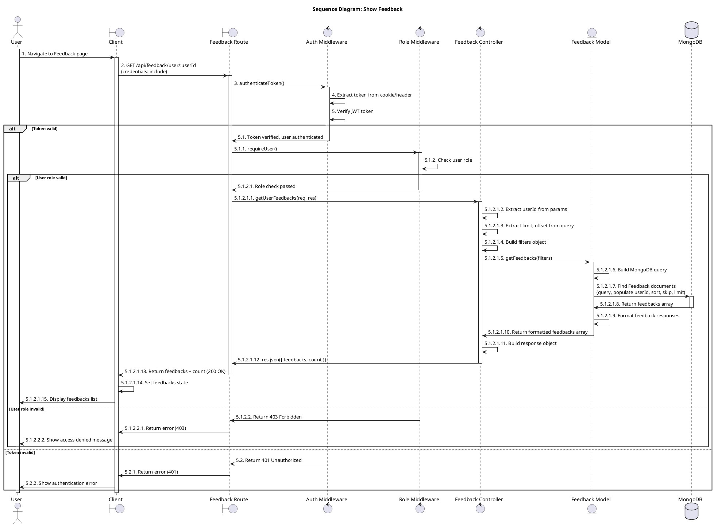
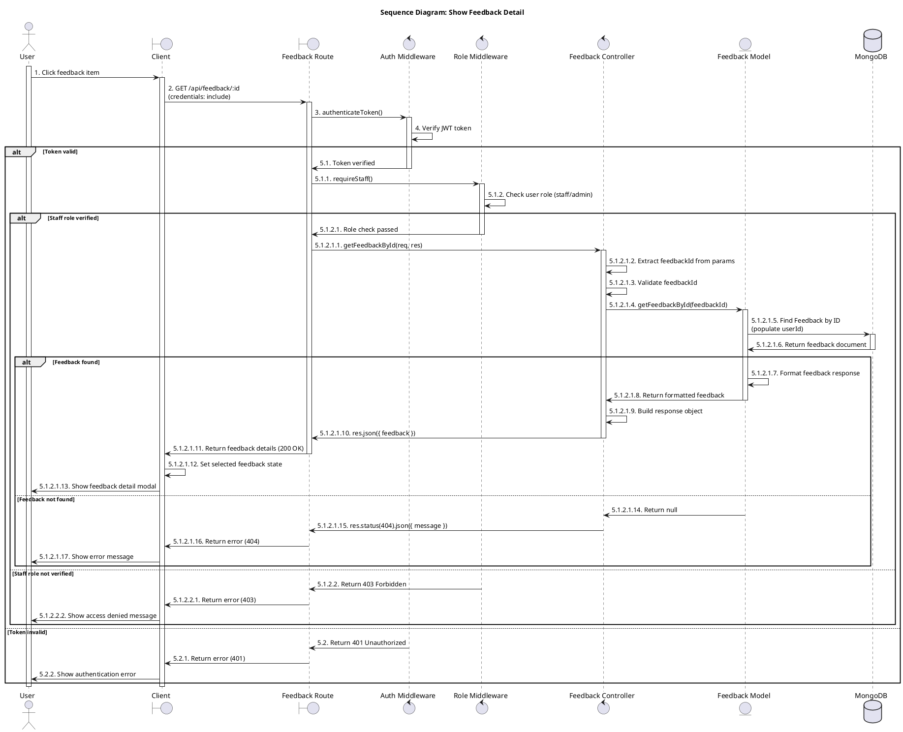
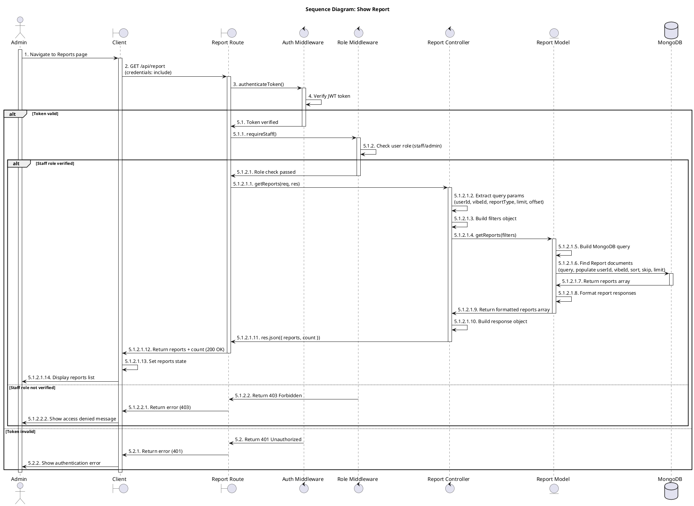
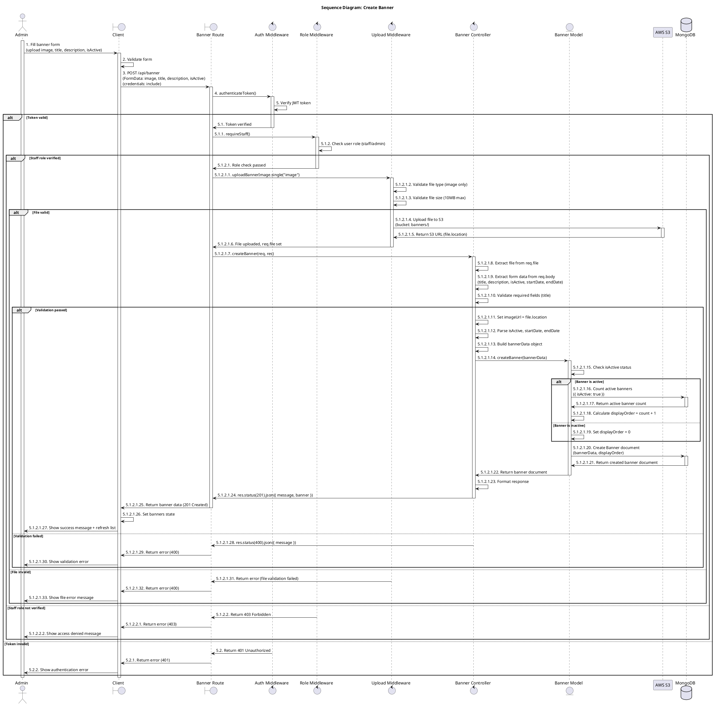
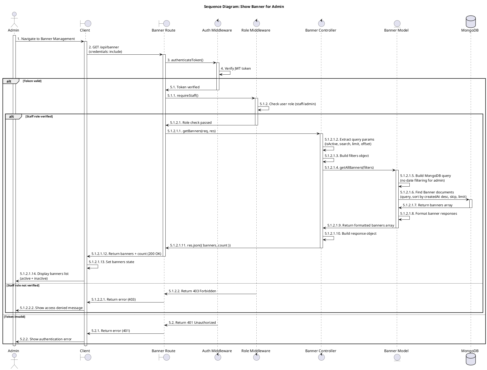
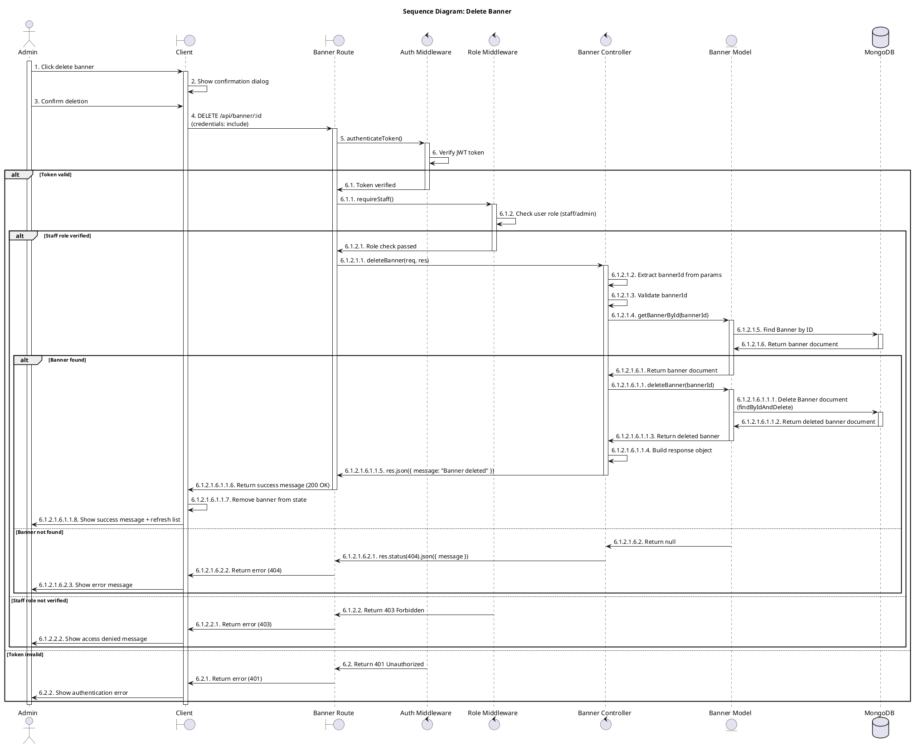
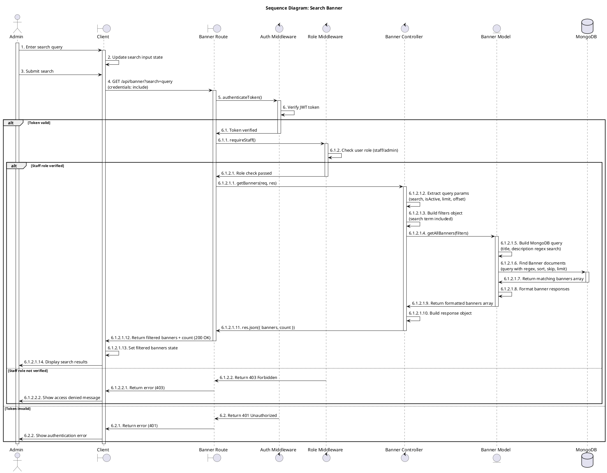
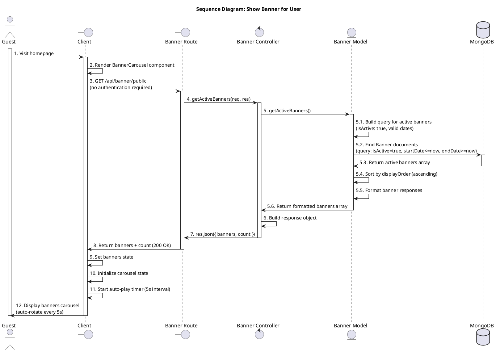

# Sequence Diagrams - Use Cases (UC_64 to UC_73)

Tài liệu này chứa các sequence diagram PlantUML cho các use case từ UC_64 đến UC_73, tuân theo quy tắc đánh số interaction với dấu chấm và mô tả chi tiết flow qua các layer.

## UC_64: Show Feedback



## UC_65: Show Feedback Detail



## UC_66: Show Report



## UC_67: Show Report Detail


## UC_68: Create Banner



## UC_69: Show Banner for Admin



## UC_70: Update Banner
```
@startuml Update Banner
title Sequence Diagram: Update Banner (Optimized)

actor Admin
boundary "Client" as Client
boundary "Banner Route" as Route
control "Auth Middleware" as AuthMiddleware
control "Role Middleware" as RoleMiddleware
control "Upload Middleware" as UploadMiddleware
control "Banner Controller" as Controller
entity "Banner Model" as Model
participant "AWS S3" as S3
database "MongoDB" as Database

activate Admin
Admin -> Client : 1. Click edit banner
activate Client
Client -> Client : 2. Load current banner data
Admin -> Client : 3. Modify banner data\n(image?, title, description, isActive)
Client -> Client : 4. Validate form input
Client -> Route : 5. PUT /api/banner/:id\n(FormData: image?, title, description, isActive)\n(credentials: include)
activate Route

group Authentication
    Route -> AuthMiddleware : 6. authenticateToken()
    activate AuthMiddleware
    AuthMiddleware -> AuthMiddleware : 6.1 Verify JWT token
    alt Token valid
        AuthMiddleware -> Route : 6.1.1 Token verified
    else Token invalid
        AuthMiddleware -> Route : 6.1.2 Return 401 Unauthorized
        Route -> Client : 6.1.2.1 Return error (401)
        Client -> Admin : 6.1.2.2 Show authentication error
        deactivate AuthMiddleware
        deactivate Route
        deactivate Client
        deactivate Admin
    end
    deactivate AuthMiddleware
end

group Authorization
    Route -> RoleMiddleware : 7. requireStaff()
    activate RoleMiddleware
    RoleMiddleware -> RoleMiddleware : 7.1 Check user role (staff/admin)
    alt Role verified
        RoleMiddleware -> Route : 7.1.1 Role check passed
    else Forbidden
        RoleMiddleware -> Route : 7.1.2 Return 403 Forbidden
        Route -> Client : 7.1.2.1 Return error (403)
        Client -> Admin : 7.1.2.2 Show access denied
        deactivate RoleMiddleware
        deactivate Route
        deactivate Client
        deactivate Admin
    end
    deactivate RoleMiddleware
end

group Upload Handling
    Route -> UploadMiddleware : 8. uploadBannerImage.single("image")
    activate UploadMiddleware
    alt Image file provided
        UploadMiddleware -> UploadMiddleware : 8.1 Validate file type & size
        alt Valid file
            UploadMiddleware -> S3 : 8.1.1 Upload to S3 (bucket: banners/)
            activate S3
            S3 -> UploadMiddleware : 8.1.2 Return S3 URL
            deactivate S3
            UploadMiddleware -> Route : 8.1.3 File uploaded\n(req.file = S3 URL)
        else Invalid file
            UploadMiddleware -> Route : 8.1.4 Return 400 (file error)
            Route -> Client : 8.1.4.1 Show file error message
            deactivate UploadMiddleware
            deactivate Route
            deactivate Client
            deactivate Admin
        end
    else No image file
        UploadMiddleware -> Route : 8.2 No upload (req.file = undefined)
    end
    deactivate UploadMiddleware
end

group Update Banner Logic
    Route -> Controller : 9. updateBanner(req, res)
    activate Controller
    Controller -> Controller : 9.1 Extract params & form data\n(title, description, isActive, dates)
    Controller -> Controller : 9.2 Validate bannerId & fields
    alt Validation passed
        Controller -> Model : 9.3 updateBanner(bannerId, updateData)
        activate Model

        Model -> Database : 9.3.1 Find banner by ID
        activate Database
        Database -> Model : 9.3.2 Return current banner
        deactivate Database

        alt Banner found
            Model -> Model : 9.3.3 Handle isActive / displayOrder update logic
            Model -> Database : 9.3.4 Update banner (findByIdAndUpdate)
            activate Database
            Database -> Model : 9.3.5 Return updated banner
            deactivate Database

            Model -> Model : 9.3.6 Format response
            Model -> Controller : 9.3.7 Return formatted banner
            deactivate Model

            Controller -> Route : 9.4 res.json({ message, banner })
            Route -> Client : 9.5 Return 200 OK + updated banner
            Client -> Client : 9.6 Update local state
            Client -> Admin : 9.7 Show success message + refresh list
        else Banner not found
            Model -> Controller : 9.3.8 Return null
            Controller -> Route : 9.3.8.1 res.status(404).json({ message })
            Route -> Client : 9.3.8.2 Return 404 Not Found
            Client -> Admin : 9.3.8.3 Show error message
        end
    else Validation failed
        Controller -> Route : 9.2.1 Return 400 Bad Request
        Route -> Client : 9.2.2 Return error (400)
        Client -> Admin : 9.2.3 Show validation error
    end
    deactivate Controller
end

deactivate Route
deactivate Client
deactivate Admin
@enduml
```


```plantuml
@startuml Update Banner
title Sequence Diagram: Update Banner

actor Admin
boundary "Client" as Client
boundary "Banner Route" as Route
control "Auth Middleware" as AuthMiddleware
control "Role Middleware" as RoleMiddleware
control "Upload Middleware" as UploadMiddleware
control "Banner Controller" as Controller
entity "Banner Model" as Model
participant "AWS S3" as S3
database "MongoDB" as Database

activate Admin
Admin -> Client : 1. Click edit banner
activate Client
Client -> Client : 2. Load banner data to form
Admin -> Client : 3. Modify banner data\n(image?, title, description, isActive)
Client -> Client : 4. Validate form
Client -> Route : 5. PUT /api/banner/:id\n(FormData: image?, title, description, isActive)\n(credentials: include)
activate Route
Route -> AuthMiddleware : 6. authenticateToken()
activate AuthMiddleware
AuthMiddleware -> AuthMiddleware : 7. Verify JWT token
alt Token valid
    AuthMiddleware -> Route : 7.1. Token verified
    deactivate AuthMiddleware
    Route -> RoleMiddleware : 7.1.1. requireStaff()
    activate RoleMiddleware
    RoleMiddleware -> RoleMiddleware : 7.1.2. Check user role (staff/admin)
    alt Staff role verified
        RoleMiddleware -> Route : 7.1.2.1. Role check passed
        deactivate RoleMiddleware
        Route -> UploadMiddleware : 7.1.2.1.1. uploadBannerImage.single("image")
        activate UploadMiddleware
        alt Image file provided
            UploadMiddleware -> UploadMiddleware : 7.1.2.1.1.1. Validate file type (image only)
            UploadMiddleware -> UploadMiddleware : 7.1.2.1.1.2. Validate file size (10MB max)
            alt File valid
                UploadMiddleware -> S3 : 7.1.2.1.1.2.1. Upload file to S3\n(bucket: banners/)
                activate S3
                S3 -> UploadMiddleware : 7.1.2.1.1.2.2. Return S3 URL (file.location)
                deactivate S3
                UploadMiddleware -> Route : 7.1.2.1.1.2.3. File uploaded, req.file set
                deactivate UploadMiddleware
                Route -> Controller : 7.1.2.1.1.2.4. updateBanner(req, res)
                activate Controller
                Controller -> Controller : 7.1.2.1.1.2.5. Extract bannerId from params
                Controller -> Controller : 7.1.2.1.1.2.6. Extract file from req.file (exists)
                Controller -> Controller : 7.1.2.1.1.2.7. Extract form data from req.body\n(title, description, isActive, startDate, endDate)
                Controller -> Controller : 7.1.2.1.1.2.8. Validate bannerId
                alt Validation passed
                    Controller -> Controller : 7.1.2.1.1.2.8.1. Validate title length (if provided)
                    Controller -> Controller : 7.1.2.1.1.2.8.2. Validate description length (if provided)
                    Controller -> Controller : 7.1.2.1.1.2.8.3. Parse isActive, startDate, endDate
                    Controller -> Controller : 7.1.2.1.1.2.8.4. Set imageUrl = file.location
                    Controller -> Controller : 7.1.2.1.1.2.8.5. Build updateData object
                    Controller -> Model : 7.1.2.1.1.2.8.6. updateBanner(bannerId, updateData)
                    activate Model
                    Model -> Database : 7.1.2.1.1.2.8.7. Find current banner by ID
                    activate Database
                    Database -> Model : 7.1.2.1.1.2.8.8. Return current banner document
                    deactivate Database
                    alt Banner found
                        Model -> Model : 7.1.2.1.1.2.8.8.1. Compare oldIsActive vs newIsActive
                        alt isActive status changed
                            alt Banner activated (was inactive)
                                Model -> Database : 7.1.2.1.1.2.8.8.1.1. Count active banners\n(excluding current banner)
                                activate Database
                                Database -> Model : 7.1.2.1.1.2.8.8.1.2. Return active banner count
                                deactivate Database
                                Model -> Model : 7.1.2.1.1.2.8.8.1.3. Set displayOrder = count + 1
                            else Banner deactivated (was active)
                                Model -> Model : 7.1.2.1.1.2.8.8.1.4. Set displayOrder = 0
                            end
                        else isActive unchanged
                            alt Banner is inactive
                                Model -> Model : 7.1.2.1.1.2.8.8.1.5. Ensure displayOrder = 0
                            else Banner is active
                                Model -> Model : 7.1.2.1.1.2.8.8.1.6. Keep existing displayOrder
                            end
                        end
                        Model -> Model : 7.1.2.1.1.2.8.8.1.7. Remove displayOrder from updateData\n(auto-calculated)
                        Model -> Model : 7.1.2.1.1.2.8.8.1.8. Set updatedAt = new Date()
                        Model -> Database : 7.1.2.1.1.2.8.8.1.9. Update Banner document\n(findByIdAndUpdate)
                        activate Database
                        Database -> Model : 7.1.2.1.1.2.8.8.1.10. Return updated banner document
                        deactivate Database
                        Model -> Model : 7.1.2.1.1.2.8.8.1.11. Format banner response
                        Model -> Controller : 7.1.2.1.1.2.8.8.1.12. Return formatted banner
                        deactivate Model
                        Controller -> Controller : 7.1.2.1.1.2.8.8.1.13. Build response object
                        Controller -> Route : 7.1.2.1.1.2.8.8.1.14. res.json({ message, banner })
                        deactivate Controller
                        Route -> Client : 7.1.2.1.1.2.8.8.1.15. Return updated banner data (200 OK)
                        deactivate Route
                        Client -> Client : 7.1.2.1.1.2.8.8.1.16. Update banners state
                        Client -> Admin : 7.1.2.1.1.2.8.8.1.17. Show success message + refresh list
                    else Banner not found
                        Model -> Controller : 7.1.2.1.1.2.8.8.2. Return null
                        deactivate Model
                        Controller -> Route : 7.1.2.1.1.2.8.8.2.1. res.status(404).json({ message })
                        deactivate Controller
                        Route -> Client : 7.1.2.1.1.2.8.8.2.2. Return error (404)
                        deactivate Route
                        Client -> Admin : 7.1.2.1.1.2.8.8.2.3. Show error message
                    end
                else Validation failed
                    Controller -> Route : 7.1.2.1.1.2.8.2. res.status(400).json({ message })
                    deactivate Controller
                    Route -> Client : 7.1.2.1.1.2.8.2.1. Return error (400)
                    deactivate Route
                    Client -> Admin : 7.1.2.1.1.2.8.2.2. Show validation error
                end
            else File invalid
                UploadMiddleware -> Route : 7.1.2.1.1.2.2. Return error (file validation failed)
                deactivate UploadMiddleware
                Route -> Client : 7.1.2.1.1.2.2.1. Return error (400)
                deactivate Route
                Client -> Admin : 7.1.2.1.1.2.2.2. Show file error message
            end
        else No image file
            UploadMiddleware -> Route : 7.1.2.1.1.3. No file, req.file = undefined
            deactivate UploadMiddleware
            Route -> Controller : 7.1.2.1.1.3.1. updateBanner(req, res)
            activate Controller
            Controller -> Controller : 7.1.2.1.1.3.2. Extract bannerId from params
            Controller -> Controller : 7.1.2.1.1.3.3. Extract file from req.file (undefined)
            Controller -> Controller : 7.1.2.1.1.3.4. Extract form data from req.body\n(title, description, isActive, startDate, endDate)
            Controller -> Controller : 7.1.2.1.1.3.5. Validate bannerId
            alt Validation passed
                Controller -> Controller : 7.1.2.1.1.3.5.1. Validate title length (if provided)
                Controller -> Controller : 7.1.2.1.1.3.5.2. Validate description length (if provided)
                Controller -> Controller : 7.1.2.1.1.3.5.3. Parse isActive, startDate, endDate
                Controller -> Controller : 7.1.2.1.1.3.5.4. imageUrl not updated (no file)
                Controller -> Controller : 7.1.2.1.1.3.5.5. Build updateData object
                Controller -> Model : 7.1.2.1.1.3.5.6. updateBanner(bannerId, updateData)
                activate Model
                Model -> Database : 7.1.2.1.1.3.5.7. Find current banner by ID
                activate Database
                Database -> Model : 7.1.2.1.1.3.5.8. Return current banner document
                deactivate Database
                alt Banner found
                    Model -> Model : 7.1.2.1.1.3.5.8.1. Compare oldIsActive vs newIsActive
                    alt isActive status changed
                        alt Banner activated (was inactive)
                            Model -> Database : 7.1.2.1.1.3.5.8.1.1. Count active banners\n(excluding current banner)
                            activate Database
                            Database -> Model : 7.1.2.1.1.3.5.8.1.2. Return active banner count
                            deactivate Database
                            Model -> Model : 7.1.2.1.1.3.5.8.1.3. Set displayOrder = count + 1
                        else Banner deactivated (was active)
                            Model -> Model : 7.1.2.1.1.3.5.8.1.4. Set displayOrder = 0
                        end
                    else isActive unchanged
                        alt Banner is inactive
                            Model -> Model : 7.1.2.1.1.3.5.8.1.5. Ensure displayOrder = 0
                        else Banner is active
                            Model -> Model : 7.1.2.1.1.3.5.8.1.6. Keep existing displayOrder
                        end
                    end
                    Model -> Model : 7.1.2.1.1.3.5.8.1.7. Remove displayOrder from updateData\n(auto-calculated)
                    Model -> Model : 7.1.2.1.1.3.5.8.1.8. Set updatedAt = new Date()
                    Model -> Database : 7.1.2.1.1.3.5.8.1.9. Update Banner document\n(findByIdAndUpdate)
                    activate Database
                    Database -> Model : 7.1.2.1.1.3.5.8.1.10. Return updated banner document
                    deactivate Database
                    Model -> Model : 7.1.2.1.1.3.5.8.1.11. Format banner response
                    Model -> Controller : 7.1.2.1.1.3.5.8.1.12. Return formatted banner
                    deactivate Model
                    Controller -> Controller : 7.1.2.1.1.3.5.8.1.13. Build response object
                    Controller -> Route : 7.1.2.1.1.3.5.8.1.14. res.json({ message, banner })
                    deactivate Controller
                    Route -> Client : 7.1.2.1.1.3.5.8.1.15. Return updated banner data (200 OK)
                    deactivate Route
                    Client -> Client : 7.1.2.1.1.3.5.8.1.16. Update banners state
                    Client -> Admin : 7.1.2.1.1.3.5.8.1.17. Show success message + refresh list
                else Banner not found
                    Model -> Controller : 7.1.2.1.1.3.5.8.2. Return null
                    deactivate Model
                    Controller -> Route : 7.1.2.1.1.3.5.8.2.1. res.status(404).json({ message })
                    deactivate Controller
                    Route -> Client : 7.1.2.1.1.3.5.8.2.2. Return error (404)
                    deactivate Route
                    Client -> Admin : 7.1.2.1.1.3.5.8.2.3. Show error message
                end
            else Validation failed
                Controller -> Route : 7.1.2.1.1.3.5.2. res.status(400).json({ message })
                deactivate Controller
                Route -> Client : 7.1.2.1.1.3.5.2.1. Return error (400)
                deactivate Route
                Client -> Admin : 7.1.2.1.1.3.5.2.2. Show validation error
            end
        end
    else Staff role not verified
        RoleMiddleware -> Route : 7.1.2.2. Return 403 Forbidden
        deactivate RoleMiddleware
        Route -> Client : 7.1.2.2.1. Return error (403)
        deactivate Route
        Client -> Admin : 7.1.2.2.2. Show access denied message
    end
else Token invalid
    AuthMiddleware -> Route : 7.2. Return 401 Unauthorized
    deactivate AuthMiddleware
    Route -> Client : 7.2.1. Return error (401)
    deactivate Route
    Client -> Admin : 7.2.2. Show authentication error
end
deactivate Client
deactivate Admin
@enduml
```

## UC_71: Delete Banner



## UC_72: Search Banner



## UC_73: Show Banner for User



## Cách sử dụng

1. Copy code PlantUML từ các section trên
2. Dán vào editor hỗ trợ PlantUML (VS Code với extension, hoặc online: http://www.plantuml.com/plantuml/uml/)
3. Hoặc sử dụng với file `.puml` và render bằng công cụ PlantUML

## Quy tắc đánh số

- **Interaction numbering**: Mọi interaction đều có số thứ tự với dấu chấm sau số (ví dụ: `1.`, `2.`, `3.`)
- **Alt block numbering**: Sử dụng số thập phân (ví dụ: `4.1.`, `4.2.`)
- **Nested alt blocks**: Sử dụng số thập phân lồng nhau (ví dụ: `4.2.1.`, `4.2.2.`)
- **Return messages**: Cũng được đánh số nhất quán theo quy tắc tương ứng
- **Activation bars**: Mọi participant được activate khi được gọi và deactivate sau khi phản hồi
- **Guest actor**: Được activate ở đầu flow và deactivate ở cuối flow
- **Title**: Không chứa số thứ tự

## Architecture Layers

- **Client (Boundary)**: Client-side React/Next.js application
- **Route (Boundary)**: Express routes, entry point for API requests
- **Auth Middleware (Control)**: JWT token authentication
- **Role Middleware (Control)**: Role-based authorization (admin, staff, user)
- **Upload Middleware (Control)**: File upload validation and S3 upload
- **Controller (Control)**: Business logic, request validation, response formatting
- **Model (Entity)**: Data access layer, MongoDB queries, data transformation
- **Database**: MongoDB database
- **AWS S3**: Cloud storage for files

## Flow Pattern

1. **Client** → **Route**: HTTP request
2. **Route** → **Auth Middleware**: Authentication check
3. **Route** → **Role Middleware**: Authorization check
4. **Route** → **Upload Middleware** (if file upload): File validation and upload
5. **Route** → **Controller**: Business logic
6. **Controller** → **Model**: Data access
7. **Model** → **Database**: MongoDB queries
8. **Database** → **Model**: Return data
9. **Model** → **Controller**: Formatted data
10. **Controller** → **Route**: Response
11. **Route** → **Client**: HTTP response
12. **Client**: Update state and UI

## Ghi chú

- Tất cả các flow đều có error handling với các nhánh alt
- Authentication và authorization được kiểm tra ở middleware layer
- File uploads được xử lý qua Upload Middleware trước khi đến Controller
- MongoDB queries được thực hiện qua Model layer (Entity)
- Database operations chỉ được thực hiện thông qua Model, không trực tiếp từ Controller
- Client state management được cập nhật sau mỗi API response
