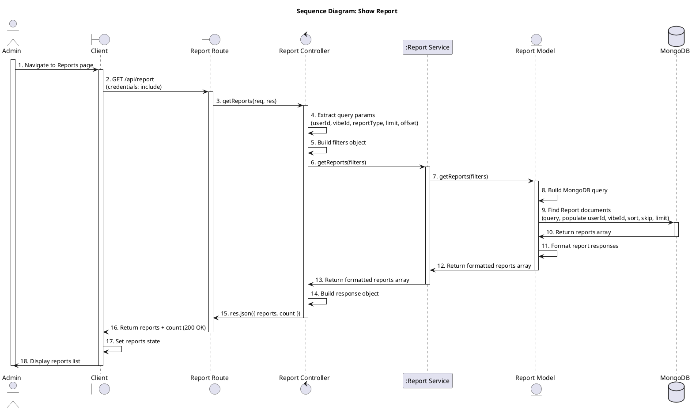
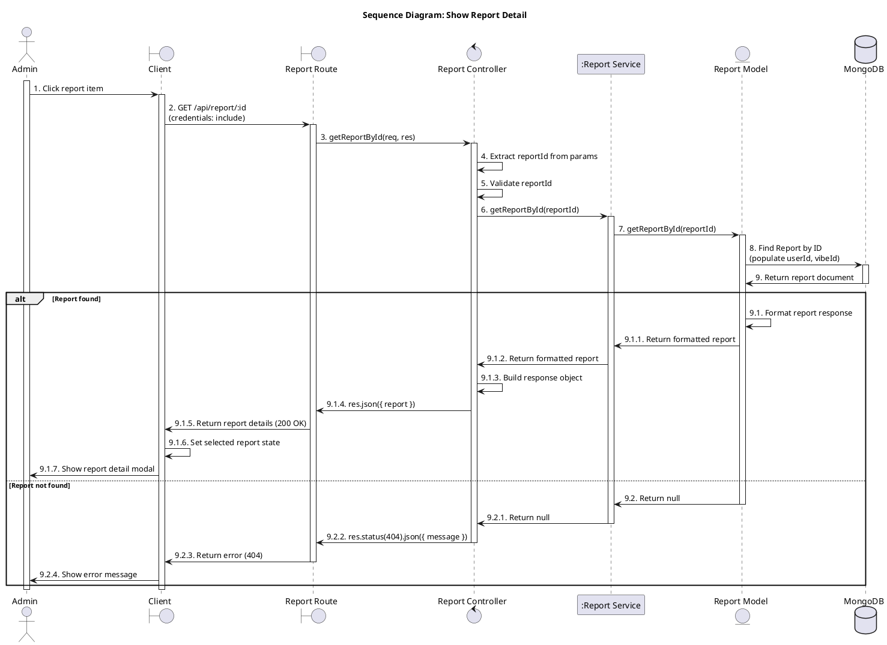
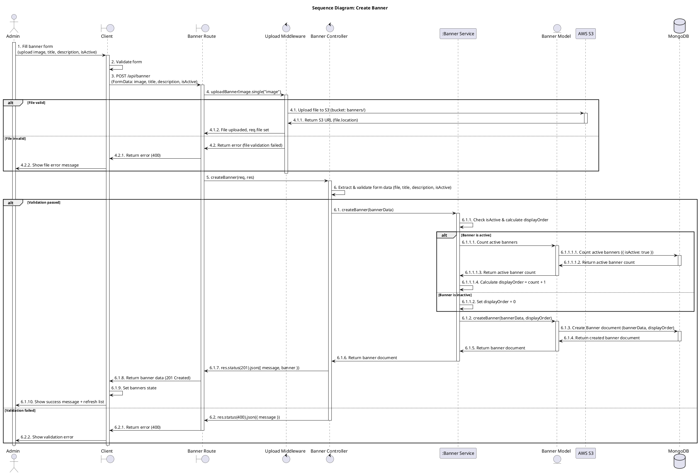
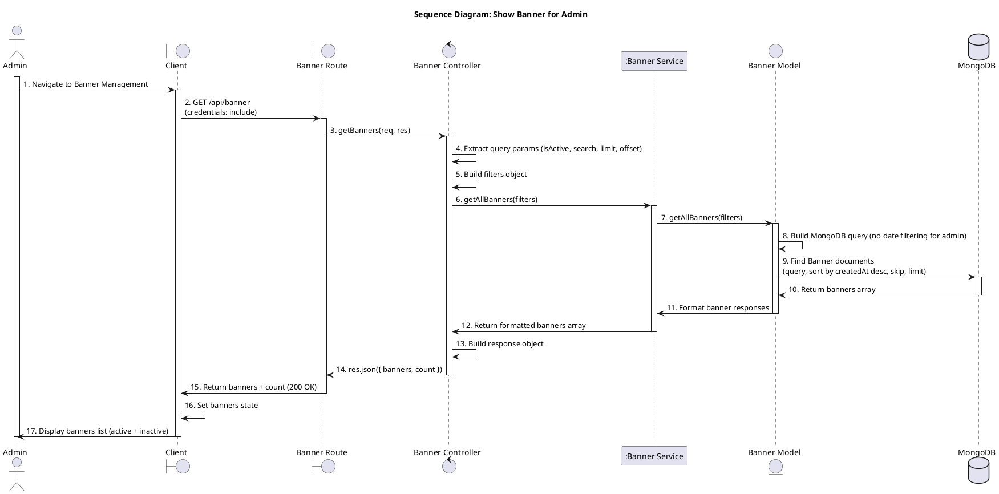
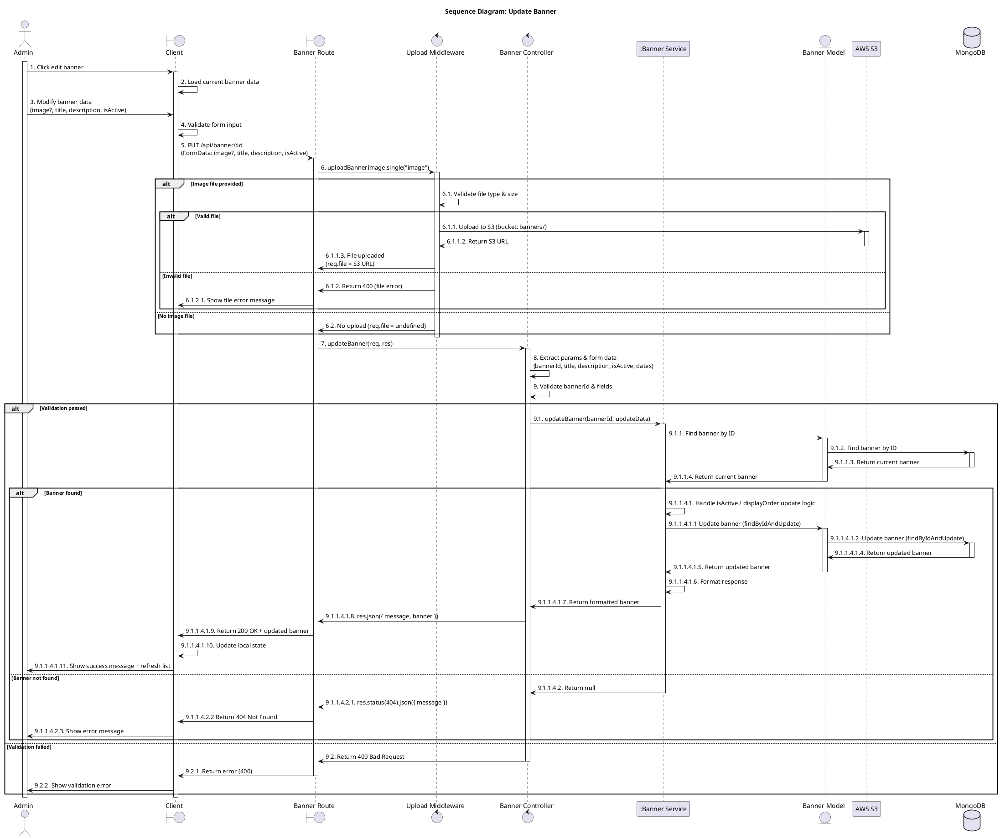
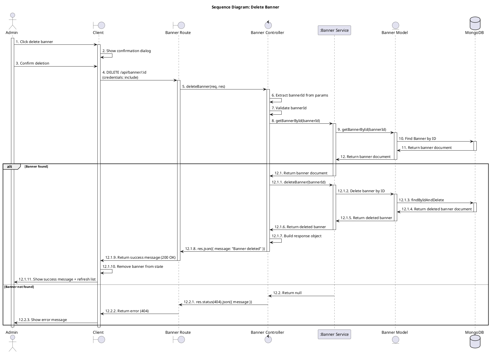
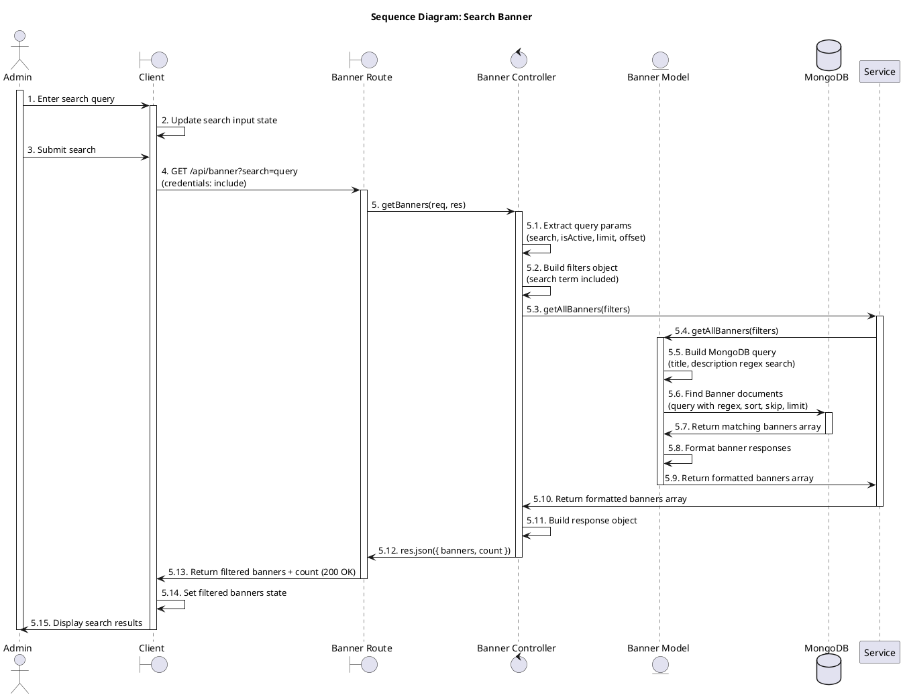
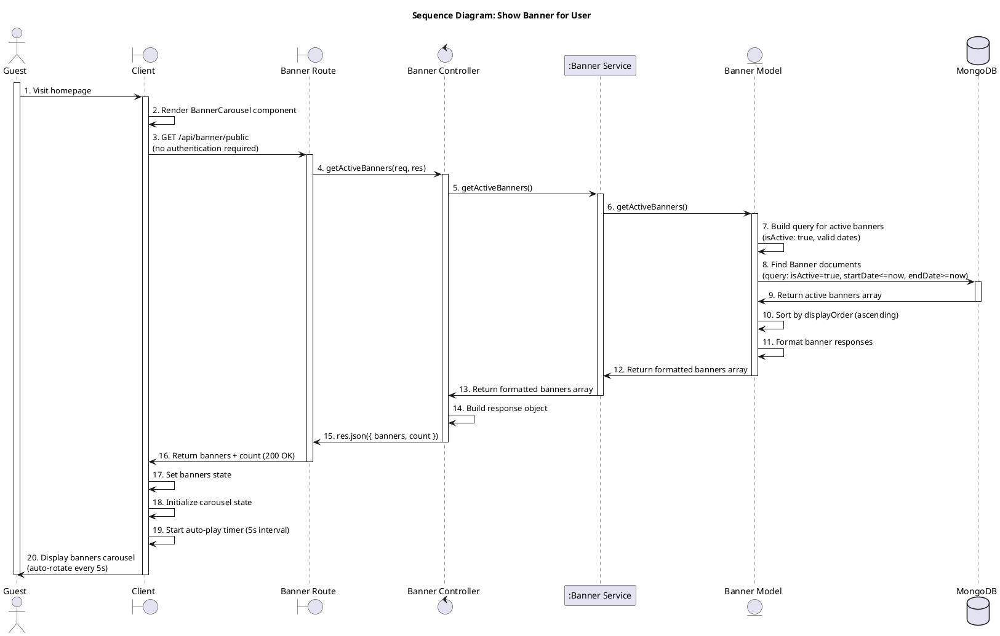

## UC_66: Show Report

## UC_67: Show Report Detail

## UC_68: Create Banner

## UC_69: Show Banner for Admin

## UC_70: Update Banner

## UC_71: Delete Banner

## UC_72: Search Banner

## UC_73: Show Banner for User

## Cách sử dụng

1. Copy code PlantUML từ các section trên
2. Dán vào editor hỗ trợ PlantUML (VS Code với extension, hoặc online: http://www.plantuml.com/plantuml/uml/)
3. Hoặc sử dụng với file `.puml` và render bằng công cụ PlantUML

## Quy tắc đánh số

- **Interaction numbering**: Mọi interaction đều có số thứ tự với dấu chấm sau số (ví dụ: `1.`, `2.`, `3.`)
- **Alt block numbering**: Sử dụng số thập phân (ví dụ: `4.1.`, `4.2.`)
- **Nested alt blocks**: Sử dụng số thập phân lồng nhau (ví dụ: `4.2.1.`, `4.2.2.`)
- **Return messages**: Cũng được đánh số nhất quán theo quy tắc tương ứng
- **Activation bars**: Mọi participant được activate khi được gọi và deactivate sau khi phản hồi
- **Guest actor**: Được activate ở đầu flow và deactivate ở cuối flow
- **Title**: Không chứa số thứ tự

## Architecture Layers

- **Client (Boundary)**: Client-side React/Next.js application
- **Route (Boundary)**: Express routes, entry point for API requests
- **Auth Middleware (Control)**: JWT token authentication
- **Role Middleware (Control)**: Role-based authorization (admin, staff, user)
- **Upload Middleware (Control)**: File upload validation and S3 upload
- **Controller (Control)**: Request validation, response formatting
- **Service (Participant)**: Business logic layer
- **Model (Entity)**: Data access layer, MongoDB queries, data transformation
- **Database**: MongoDB database
- **AWS S3**: Cloud storage for files

## Flow Pattern

1. **Client** → **Route**: HTTP request
2. **Route** → **Auth Middleware**: Authentication check
3. **Route** → **Role Middleware**: Authorization check
4. **Route** → **Upload Middleware** (if file upload): File validation and upload
5. **Route** → **Controller**: Business logic
6. **Controller** → **Model**: Data access
7. **Model** → **Database**: MongoDB queries
8. **Database** → **Model**: Return data
9. **Model** → **Controller**: Formatted data
10. **Controller** → **Route**: Response
11. **Route** → **Client**: HTTP response
12. **Client**: Update state and UI

## Ghi chú

- Tất cả các flow đều có error handling với các nhánh alt
- Authentication và authorization được kiểm tra ở middleware layer
- File uploads được xử lý qua Upload Middleware trước khi đến Controller
- Business logic được xử lý ở Service layer
- MongoDB queries được thực hiện qua Model layer (Entity)
- Database operations chỉ được thực hiện thông qua Model, không trực tiếp từ Controller hoặc Service
- Client state management được cập nhật sau mỗi API response
