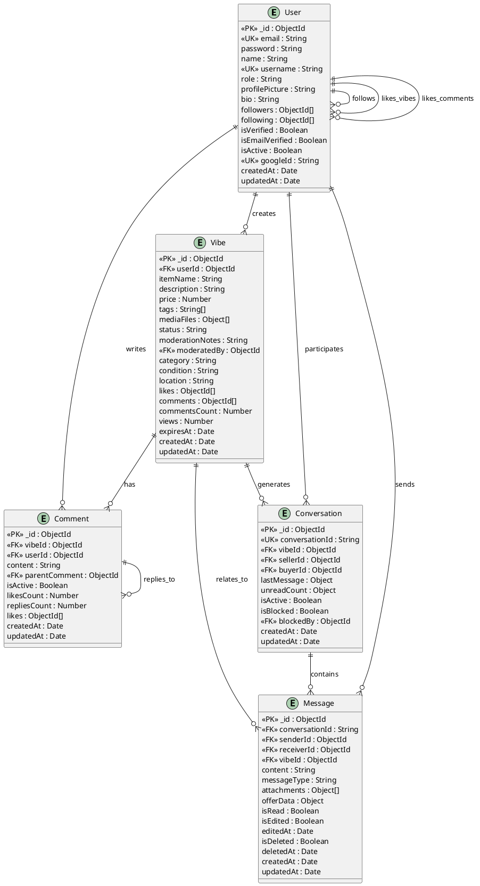
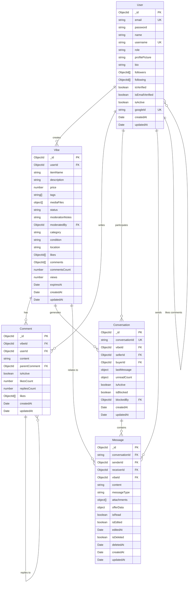

# Database Schema - OldVibes Backend

## ERD Diagram - PlantUML

## ERD Diagram - Mermaid (Alternative)

## Schema Details

### 1. User Collection
- **Primary Key**: `_id` (ObjectId)
- **Unique Fields**: `email`, `username`, `googleId`
- **Role Types**: admin, staff, user, guest
- **OAuth Support**: Google authentication with `googleId`
- **Social Features**: followers/following arrays
- **Verification**: email and account verification flags

### 2. Vibe Collection
- **Primary Key**: `_id` (ObjectId)
- **Foreign Keys**: `userId` → User, `moderatedBy` → User
- **Status Types**: pending, approved, rejected, sold, archived
- **Condition Types**: new, like-new, good, fair, poor
- **Media Support**: images and videos with thumbnails
- **Auto-expiry**: 24-hour TTL with `expiresAt` field
- **Engagement**: likes, comments, views tracking

### 3. Comment Collection
- **Primary Key**: `_id` (ObjectId)
- **Foreign Keys**: `vibeId` → Vibe, `userId` → User, `parentComment` → Comment
- **Hierarchical**: Supports nested replies via `parentComment`
- **Engagement**: likes tracking and counts
- **Soft Delete**: `isActive` flag for content moderation

### 4. Conversation Collection
- **Primary Key**: `_id` (ObjectId)
- **Unique Field**: `conversationId` (string)
- **Foreign Keys**: `vibeId` → Vibe, `sellerId` → User, `buyerId` → User, `blockedBy` → User
- **Compound Indexes**: Optimized for user conversations and active status
- **Unread Tracking**: Separate counters for seller and buyer
- **Blocking**: Support for conversation blocking

### 5. Message Collection
- **Primary Key**: `_id` (ObjectId)
- **Foreign Keys**: `senderId` → User, `receiverId` → User, `vibeId` → Vibe
- **Message Types**: text, image, offer, system
- **Attachments**: Support for files and images
- **Offer System**: Built-in offer/negotiation functionality
- **Message States**: read, edited, deleted tracking

## Key Features

### Authentication & Authorization
- Multi-role system (admin, staff, user, guest)
- OAuth integration (Google)
- Email verification system
- Account verification and activation

### Content Management
- Vibe posting with media support
- Comment system with nested replies
- Content moderation workflow
- Auto-expiry for vibes (24 hours)

### Social Features
- User following system
- Like system for vibes and comments
- View tracking
- User profiles with bio and pictures

### Messaging System
- Conversation-based messaging
- Offer/negotiation system
- File and image attachments
- Message states (read, edited, deleted)
- Conversation blocking

### Performance Optimizations
- Strategic indexing for queries
- Compound indexes for complex queries
- TTL indexes for auto-cleanup
- Efficient relationship modeling
