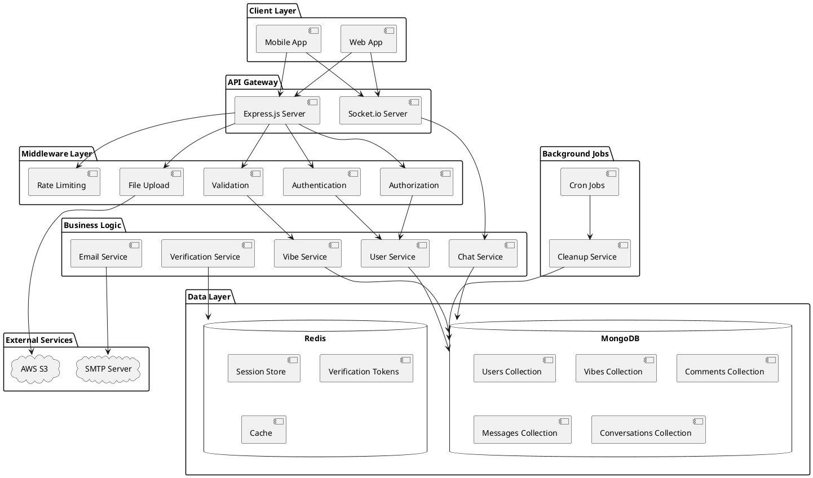
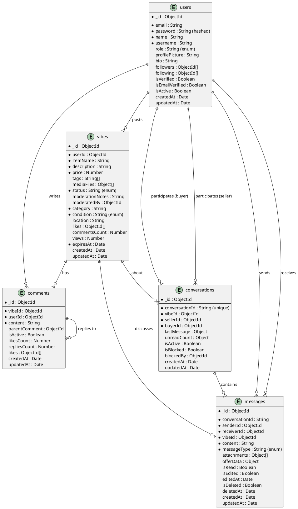
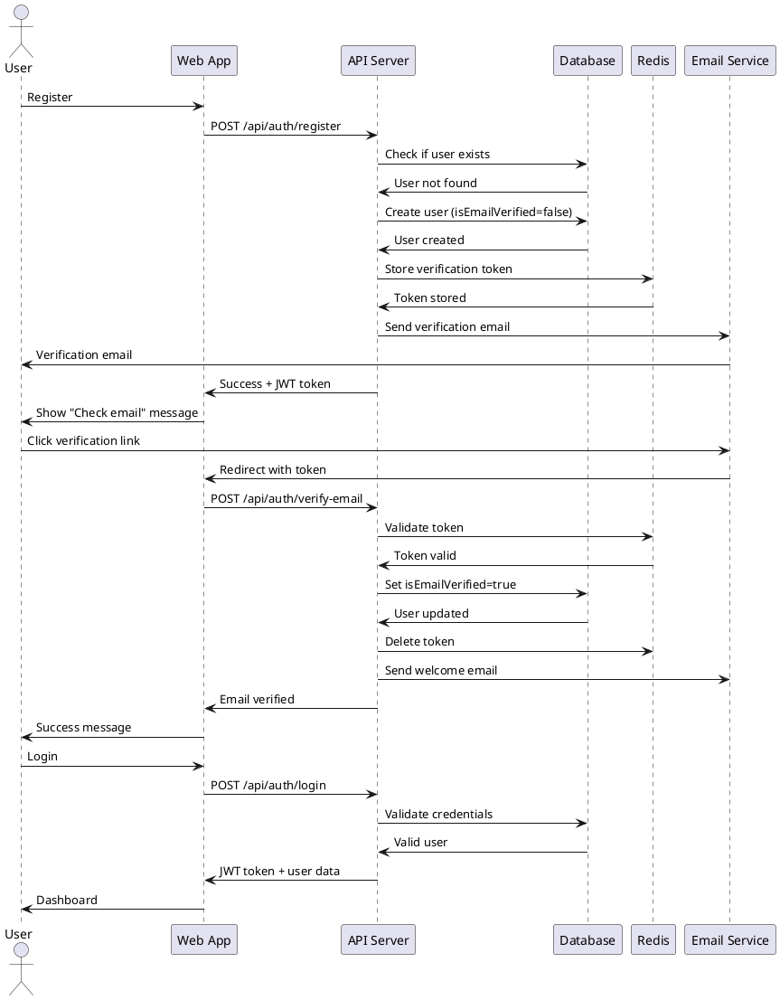
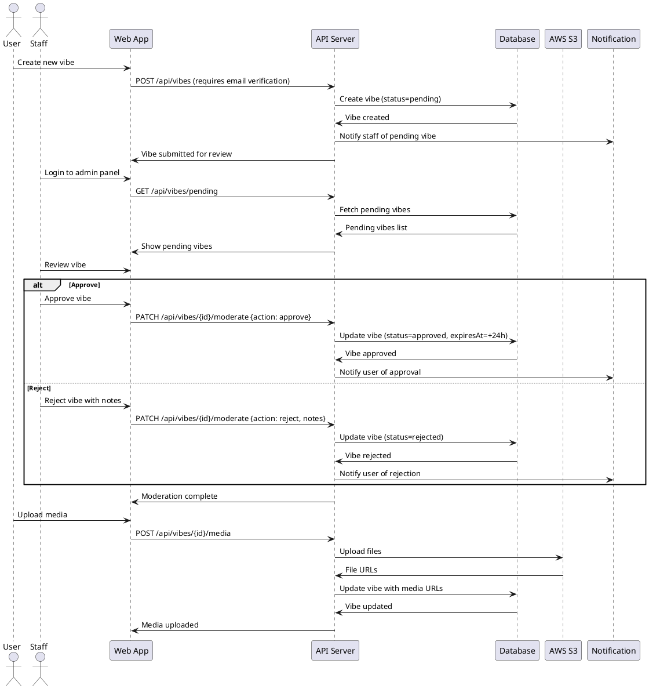
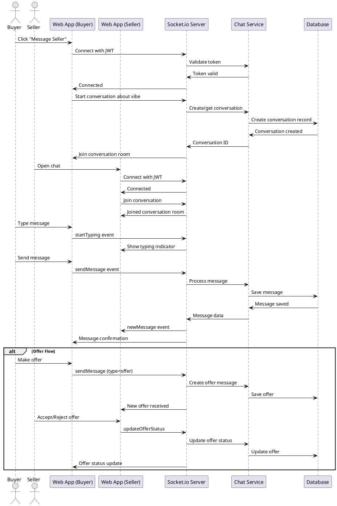
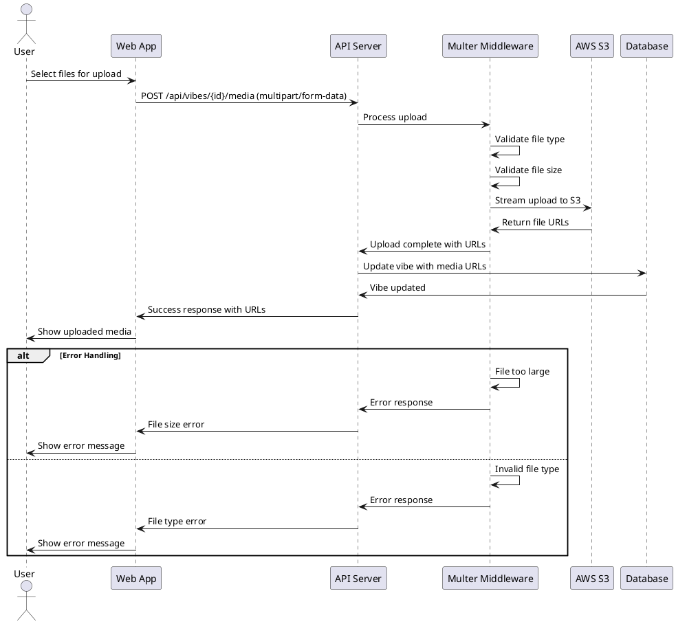
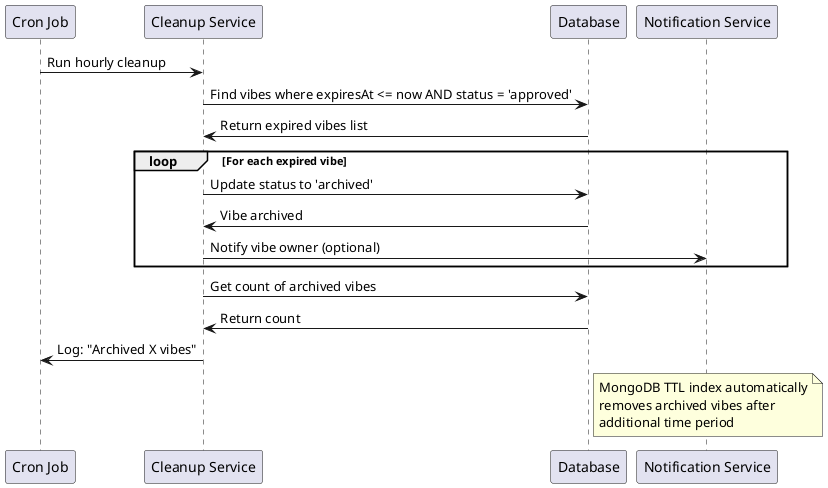
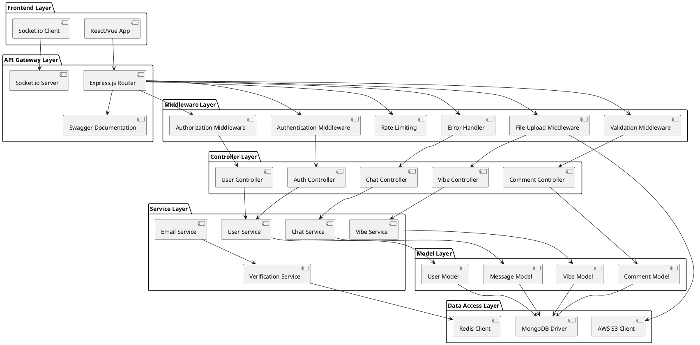
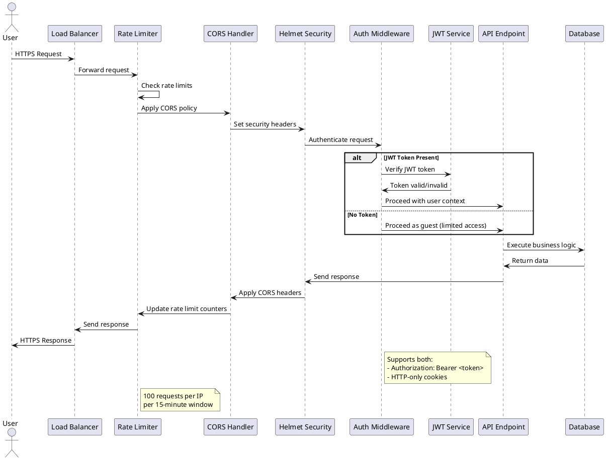
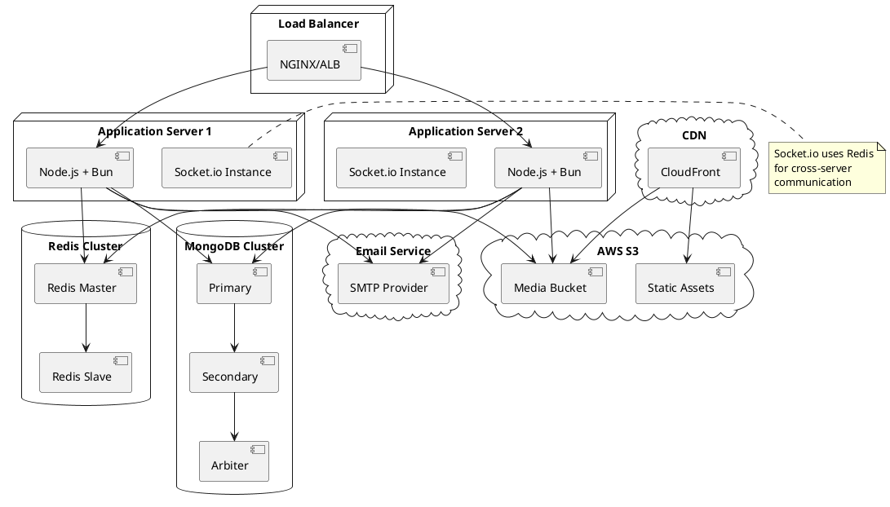

# Old Vibes - Software Design Document & User Flows

## User Flow Examples

### 1. New User Registration & First Vibe Flow

```
1. User visits the platform
2. User clicks "Sign Up"
3. User fills registration form (email, password, name, username)
4. System creates account with isEmailVerified=false
5. System sends verification email
6. User receives email and clicks verification link
7. System verifies email and sets isEmailVerified=true
8. User gets welcome email
9. User logs in and sees dashboard
10. User clicks "Post Vibe"
11. User fills item details (name, description, price, category, condition)
12. User uploads photos/videos (max 5 files)
13. System creates vibe with status="pending"
14. Staff receives notification for moderation
15. Staff reviews and approves vibe
16. Vibe goes live for 24 hours
17. Other users can see, like, comment, and message about the item
18. After 24 hours, vibe automatically archives
```

### 2. Buyer Journey Flow

```
1. User browses trending vibes or searches for items
2. User finds interesting item
3. User views vibe details (increments view count)
4. User likes the vibe
5. User adds comment asking about availability
6. Seller responds to comment
7. User clicks "Message Seller"
8. System creates conversation between buyer and seller
9. Real-time chat begins via Socket.io
10. Buyer asks questions about the item
11. Buyer makes offer through chat
12. Seller accepts/rejects offer
13. If accepted, users exchange contact details
14. Seller marks item as "sold"
15. Vibe status changes to "sold"
```

### 3. Seller Journey Flow

```
1. Seller posts vibe (goes through moderation)
2. Vibe gets approved and goes live
3. Buyers start viewing, liking, commenting
4. Seller receives notifications for interactions
5. Buyer initiates conversation about item
6. Seller responds via real-time chat
7. Negotiation happens through chat system
8. Deal is agreed upon
9. Seller marks item as sold
10. Conversation can continue for logistics
11. After 24 hours, original vibe archives
12. Seller can post new vibes
```

### 4. Staff Moderation Flow

```
1. User submits new vibe
2. Vibe enters "pending" status
3. Staff member logs in with staff credentials
4. Staff accesses moderation dashboard
5. Staff reviews pending vibes (FIFO order)
6. Staff examines photos, description, pricing
7. Staff either:
   - Approves: Vibe goes live
   - Rejects: Vibe gets "rejected" status with notes
8. User receives notification of decision
9. If rejected, user can edit and resubmit
10. Process repeats until approved or user gives up
```

### 5. Social Features Flow

```
1. User discovers another user's profile
2. User clicks "Follow"
3. System updates follower/following counts
4. User can see followed users' vibes in feed
5. User can like and comment on vibes
6. User can share vibes to social media
7. User builds social network within platform
8. User receives notifications for social interactions
```

## PlantUML Diagrams for Software Design Document

### 1. System Architecture Diagram



### 2. Database Entity Relationship Diagram



### 3. User Authentication Flow



### 4. Vibe Creation and Moderation Flow



### 5. Real-time Chat System Flow



### 6. File Upload System Flow



### 7. Auto-Expiry System Flow



### 8. Component Architecture Diagram



### 9. Security Architecture Flow



### 10. Deployment Architecture



## Key Technical Specifications for SDD

### 1. Performance Requirements
- **Response Time**: < 200ms for API calls
- **Concurrent Users**: Support 10,000 simultaneous connections
- **File Upload**: Handle 10MB files efficiently
- **Database**: Sub-100ms query response time
- **WebSocket**: Real-time message delivery < 50ms

### 2. Scalability Requirements
- **Horizontal Scaling**: Stateless application servers
- **Database Sharding**: MongoDB horizontal scaling
- **CDN Integration**: Global content delivery
- **Load Balancing**: Multi-server deployment
- **Auto-scaling**: Based on CPU/memory metrics

### 3. Security Requirements
- **Authentication**: JWT with 7-day expiry
- **Authorization**: Role-based access control
- **Data Encryption**: HTTPS/TLS in transit, bcrypt for passwords
- **Rate Limiting**: 100 requests/15min per IP
- **Input Validation**: Server-side validation for all inputs
- **File Security**: Type and size validation for uploads

### 4. Availability Requirements
- **Uptime**: 99.9% availability target
- **Backup**: Daily automated database backups
- **Disaster Recovery**: Cross-region replication
- **Monitoring**: Health checks and alerting
- **Graceful Degradation**: Core features available during partial outages

### 5. Data Requirements
- **Data Retention**:
  - Active vibes: 24 hours
  - Archived vibes: 30 days
  - User data: Indefinite (until account deletion)
  - Chat messages: 1 year
- **Backup Strategy**:
  - Daily full backups
  - Point-in-time recovery capability
  - Cross-region backup storage

### 6. Integration Requirements
- **AWS S3**: Media file storage and CDN
- **SMTP**: Email delivery service
- **Redis**: Session management and caching
- **MongoDB**: Primary data storage
- **Socket.io**: Real-time communication

### 7. Browser/Platform Support
- **Web Browsers**: Chrome 90+, Firefox 88+, Safari 14+, Edge 90+
- **Mobile**: Progressive Web App (PWA) support
- **API**: RESTful HTTP/HTTPS with WebSocket support
- **Real-time**: Socket.io with fallback transports
